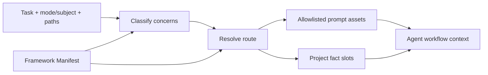
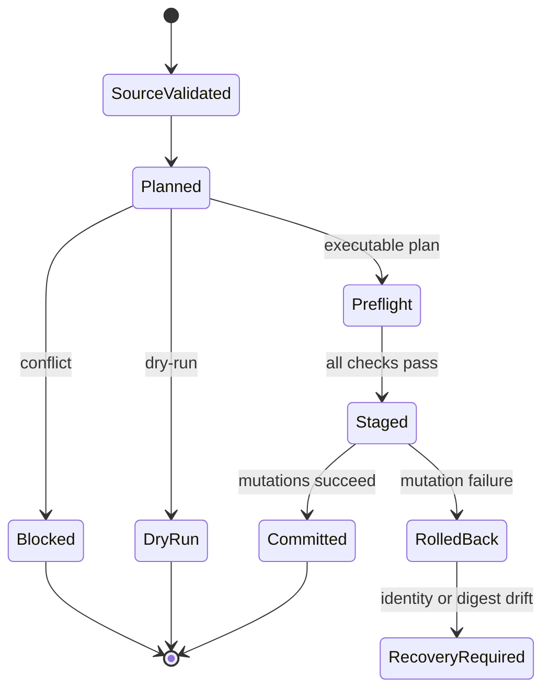

# Workflow Architecture

## 系统边界

| Owner                                     | 权威内容                                                                                                                   | 边界                                  |
| ----------------------------------------- | -------------------------------------------------------------------------------------------------------------------------- | ------------------------------------- |
| `.ousia/framework.json`                   | Framework identity、逐文件inventory、ownership、task/concern routes、project fact slots、validation routes、prompt budgets | 不保存prompt规则正文或项目具体事实    |
| `.github/instructions/**`                 | 自动适用的短硬规则与宿主frontmatter投影                                                                                    | 不保存任务流程或route matrix          |
| `.github/skills/**`                       | Entry/domain workflow、输入、mode、stop conditions、输出与review义务                                                       | 不拥有其他skill的route或项目facts     |
| `.ousia/project.json`、`.ousia/design/**` | 当前项目identity、Architecture、Proposal和Experience facts                                                                 | 首次创建后由项目完整拥有              |
| Installer runtime                         | Source validation、plan和事务提交                                                                                          | 不解释prompt语义，不合并project facts |

`ext-ousia-workflow.instructions.md` 是当前仓库self-host policy，不进入baseline
inventory、route或目标项目。

## Prompt Route

- Manifest是route canonical contract；Markdown只保存owning
  workflow正文，frontmatter只是VS Code discovery投影。
- Baseline instructions只有workflow bootstrap、跨语言工程硬规范、prompt
  ownership和documentation protocol四个。
- 工程instruction只拥有调用边界、唯一owner、失败前置检查、抽象有效性和测试evidence等自动适用的不变量；`engineering-quality`与`test-engineering`按task/subject/concern加载详细evidence、smell和测试策略。
- Planning mode归`architecture-planner`，review
  mode归`black-team-review`；engineering、testing、prompt、docs、doc-validation和Rust能力按concern
  lazy-load。
- Resolver精确匹配task/mode/subject，合并显式与path-derived
  concerns，按manifest顺序输出去重assets和project fact
  slots，并在返回前执行budget gate。
- Project facts只通过slot ID进入上下文；缺失可选fact不生成隐藏规则。
- 当前 Proposal 与归档 Proposal 分属 `project.proposal` 和
  `project.proposal-archive`；普通 planning、implementation 和 review route
  只读取当前提案，历史比较、决策追溯或关闭查证才定向读取归档。

## 安装生命周期

- Source snapshot精确等于manifest inventory；未列文件不安装。
- Framework assets使用replace/delete；project
  seeds使用create-once/preserve。项目Git负责接受、调整和回退baseline。
- Proposal archive index 是独立 project seed，因此归档目录随 baseline
  创建，项目写入后由 reinstall 和 update 逐字保留。
- Retirement同时需要旧target manifest membership、当前source
  tombstone和目标bytes digest；project slot永不被framework接管。
- Applier是唯一文件副作用owner。它在创建staging前完成全局preflight，在每次mutation紧前复验precondition，使用固定原子staging
  namespace、identity journal、backup rollback和manifest-last。
- Cleanup只删除仍由事务拥有的对象；identity、digest或未知内容不匹配时保留现场并报告`RecoveryRequired`。

## 验证与发布

- `ousia check`验证source manifest、inventory、frontmatter projection、route
  closure和budgets，不执行manifest声明的命令。
- `deno task release`是确定性gate：格式、lint、类型、workflow、Rust
  checker、tests、文档协议和installed CLI smoke。
- Agent行为由当前上下文或同名subagent按resolved route、真实workspace
  diff、验证结果和owning
  skills执行planning/review场景来验收；不另建模型API客户端、凭证或provider协议。
- Subagent只是执行载体，`architecture-planner`和`black-team-review`继续拥有输入、证据、输出、stop
  condition和handoff语义。
- Installed CLI smoke覆盖check、fresh、reinstall、baseline update、trusted
  retirement、project fact preserve和fresh-target文档闭合。
- Rust checker 归 `rust-engineering`，作为 framework tool asset
  安装；`check.rust-functions` 暴露 installed Rust project 的函数 owner
  验证命令。
- Rust checker 的 `module-owner` 只证明模块级函数
  owner；`use`、`const`、`static`、macro 和 extern block
  可以作为支撑项存在，类型定义、trait 定义、impl block 和 re-export 不能被
  module owner 覆盖。Checker 的 `check` 和 `report` 共享 crate/workspace source
  set 与 `syn` crate-level AST；`Cargo.toml` 通过 Cargo metadata 读取 workspace
  targets，并沿 out-of-line `mod` 展开 crate module tree，避免漏扫模块。
- Rust checker hard rules 使用静态 rule framework：`engine/mod.rs` 拥有
  AST traversal、module owner inheritance、test module skip 和 rule scheduling；
  `engine/context.rs` 拥有 path-bound diagnostics sink 和 module owner fact；
  `rules/*` 分别拥有单条 hard rule 语义。Engine/context 不保存具体 rule
  message，单条 rule 不发现 files、不解析 Cargo metadata、不打印 CLI output。
- 当前 framework inventory 使用逐文件 asset 描述 digest、ownership、retire 和
  target；目录管理若引入，必须展开为同等显式的 asset
  plan，不能绕过现有所有权和回滚语义裸扫目录。

## 稳定不变量

- Ousia拥有framework结构、生命周期、验证和reading
  protocol；项目拥有Ousia-defined slots中的事实。
- Route、inventory、ownership、frontmatter
  parsing、validation和副作用各有单一权威owner。
- Compatibility是planner显式输入；`forbidden`时不存在旧schema
  adapter、双写、兼容facade或迁移桥。
- Host-owned repository policy和local
  overrides不由baseline静默命名、覆盖或安装。
