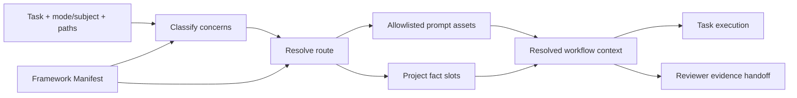
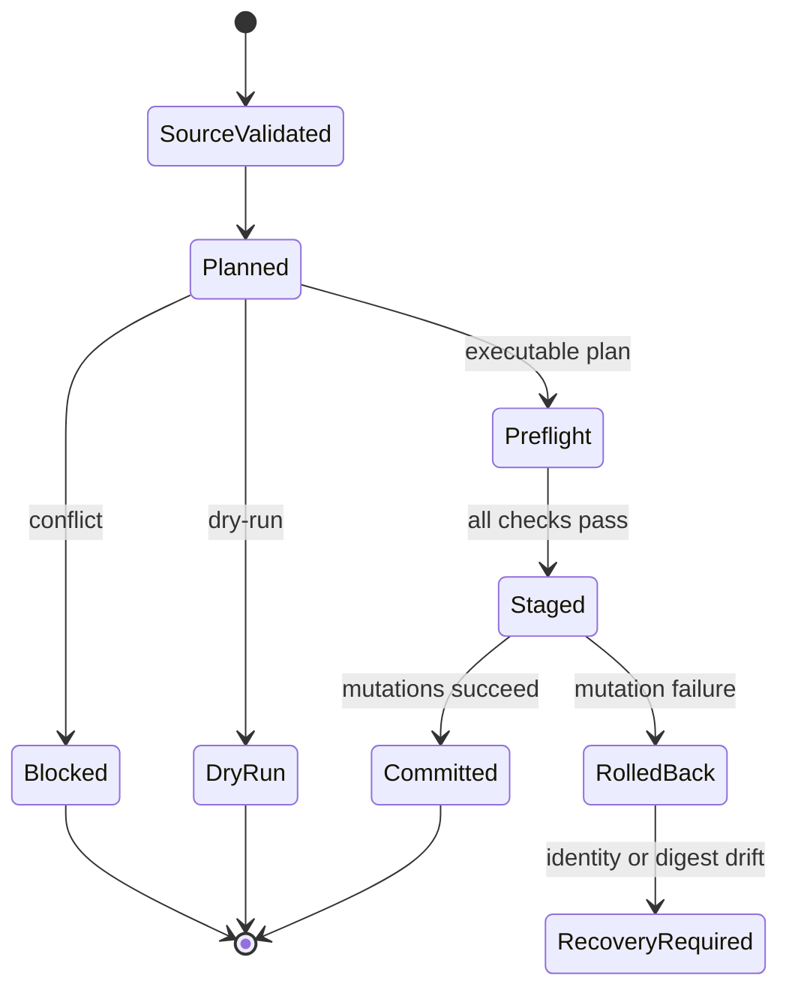

# Workflow Architecture

## 系统边界

| Owner                                     | 权威内容                                                                                                                            | 边界                                  |
| ----------------------------------------- | ----------------------------------------------------------------------------------------------------------------------------------- | ------------------------------------- |
| `.ousia/framework.json`                   | Framework identity、file/directory inventory、ownership、task/concern routes、project fact slots、validation routes、prompt budgets | 不保存prompt规则正文或项目具体事实    |
| `.github/instructions/**`                 | 自动适用的短硬规则与宿主frontmatter投影                                                                                             | 不保存任务流程或route matrix          |
| `.github/skills/**`                       | Entry/domain workflow、输入、mode、stop conditions、输出与review义务                                                                | 不拥有其他skill的route或项目facts     |
| `.github/agents/ousia-reviewer.agent.md`  | Framework安装的Reviewer身份、模型、工具边界和最小角色说明                                                                           | 不拥有review流程、判定或输出合同      |
| `.ousia/project.json`、`.ousia/design/**` | 当前项目identity、Architecture、Proposal和Experience facts                                                                          | 首次创建后由项目完整拥有              |
| Installer runtime                         | Source validation、plan和事务提交                                                                                                   | 不解释prompt语义，不合并project facts |

`ext-ousia-workflow.instructions.md` 是当前仓库self-host policy，不进入baseline
inventory、route或目标项目。

## Prompt Route

- Manifest是route canonical contract；Markdown只保存owning
  workflow正文，frontmatter只是VS Code discovery投影。
- Baseline instructions只有workflow bootstrap、跨语言工程硬规范、prompt
  ownership和documentation protocol四个。
- 工程instruction只拥有调用边界、唯一owner、失败前置检查、抽象有效性和测试evidence等自动适用的不变量；`engineering-quality`与`test-engineering`按task/subject/concern加载详细evidence、smell和测试策略。
- Planning mode归`architecture-planner`，review
  mode归`black-team-review`；engineering、testing、prompt、docs、doc-validation和Rust能力按concern
  lazy-load。
- Resolver精确匹配task/mode/subject，合并显式与path-derived
  concerns，按manifest顺序输出去重assets和project fact
  slots，并在返回前执行budget gate。
- Review 调用方只解析一次 route，并把命中的 prompt assets 和 project fact owning
  sources 交给 Reviewer。Reviewer消费该 evidence handoff，不重新读取Manifest复核route；只有Manifest或route本身属于scope，或handoff缺失、过期、与真实scope冲突时才定向读取并报告缺口。
- Project facts只通过slot ID进入上下文；缺失可选fact不生成隐藏规则。
- 当前 Proposal 与归档 Proposal 分属 `project.proposal` 和
  `project.proposal-archive`；普通 planning、implementation 和 review route
  只读取当前提案，历史比较、决策追溯或关闭查证才定向读取归档。

## 安装生命周期

- Source snapshot精确等于manifest inventory；file asset
  以单文件为单位，directory asset 以单个目录树为单位。未列入 file asset 或
  directory tree 的文件不安装。
- Framework assets使用replace/delete；project
  seeds使用create-once/preserve。项目Git负责接受、调整和回退baseline。
- Reviewer是普通framework-owned file asset；source完整bytes是唯一desired state，target任意漂移整体replace，一致时保持`identical`而不写入。
- Proposal archive index 是独立 project seed，因此归档目录随 baseline
  创建，项目写入后由 reinstall 和 update 逐字保留。
- Retirement同时需要旧target manifest membership、当前source
  tombstone和目标bytes digest；project slot永不被framework接管。
- Applier是唯一文件副作用owner。它在创建staging前完成全局preflight，在每次mutation紧前复验precondition，使用固定原子staging
  namespace、随机 sentinel guard、identity journal、backup
  rollback和manifest-last。 Staging guard 同时校验目录 identity、guard 文件
  identity 和 guard 内容，避免 Linux inode 复用导致替换后的 staging
  被误认为事务自有 namespace。
- Directory asset 只用于 framework-owned tool source，拥有单一 asset
  ID、target、tree digest 和事务边界。首次从逐文件 asset 迁移到 directory asset
  时，旧 framework-owned file membership 可由目录接管；未知 child、project-owned
  asset 和 project fact slot 必须在 planner 阶段 conflict。
- Cleanup只删除仍由事务拥有的对象；identity、digest或未知内容不匹配时保留现场并报告`RecoveryRequired`。

## 验证与发布

- `ousia check`验证source manifest、inventory、frontmatter projection、route
  closure和budgets，不执行manifest声明的命令。
- `deno task release`是确定性gate：格式、lint、类型、workflow、Rust
  checker、tests、文档协议和installed CLI smoke。
- Agent行为按resolved route、真实workspace diff、验证结果和owning skills执行。Planning与普通exploration可由当前上下文或同名subagent承载；review由当前单根 workspace 中随baseline整文件安装的 `.github/agents/ousia-reviewer.agent.md` 承载。该文件拥有执行身份、模型、取证工具和最小角色说明，`black-team-review`拥有review流程、判定与输出合同；当前baseline的model是`gpt-5.6-luna::dst (oaicopilot)`。Reviewer不进入prompt route读取闭包；用户通过安装计划和Git接受、调整或回退baseline。已知同名来源未清理或模型不可用时不启动review。
- `black-team-review`拥有materiality、strictness、blocking disposition和复审stop
  condition。默认focused只让critical/high驱动自动返工；非阻塞观察由用户决定，deterministic validation gate不受review强度影响。
- Subagent只是执行载体，`architecture-planner`和`black-team-review`继续拥有输入、证据、输出、stop
  condition和handoff语义。
- Installed CLI smoke使用隔离Cargo/Deno install roots覆盖双工具bootstrap、check、fresh、reinstall、baseline update、trusted
  retirement、project fact preserve和fresh-target文档闭合。
- Rust checker 归 `rust-engineering`，由`scripts/install.ts`先安装到Cargo默认root并验证
  `ousia.rust-checker-build.v1` identity，再安装Deno CLI；checker source不进入host baseline。
  Installed validation route `check.rust`只通过PATH执行`ousia-rust-checker check-project .`解析宿主
  `Cargo.toml` 或 `.ousia/project.json` 中的可选 `project.rust.sourcePaths`。字段
  absent/empty 时 Rust validation 为 not applicable；checker 自身只由仓库 release
  task `check.rust-checker-self` 验证。
- Rust checker 只接受一个或多个 `Cargo.toml`，或当前层直接包含
  `Cargo.toml` 的目录；`check-project` 由唯一 project resolver 读取宿主根
  manifest或`project.rust.sourcePaths`中的Cargo selector。`PhysicalSourceRepository` 按 canonical path 读取并只 parse 一次，
  `LogicalInclusionGraph` 保存 target/module 的 logical occurrence、累计 cfg guard、inline/
  out-of-line inclusion 和 `#[path]` alternatives。`CfgModel` 具体代入当前 `rustc --print cfg`
  platform facts，并对 feature/custom atoms执行固定预算的symbolic SAT。Parse、cfg、graph和
  model失败均为typed fatal，公开 evaluator 不输出partial result。
- Production rules、function usage、module layout、test inventory和zero-field type report共享同一个完整
  `AnalysisSession`。`ProjectedItemIndex`拥有item/member identity、ordered attributes和
  production/test reachability；`GuardedUseIndex`拥有use-tree leaf与guarded lexical path facts，
  `CallableIndex`拥有module function、impl/trait caller、
  `Call`/`ValueReference`/receiver facts与caller/callsite/import/callee SAT关联，并以私有
  `LexicalScopes`统一处理参数、generics、closure、condition chain、match、for、block item和guarded
  pattern blocker；Production与Test universe共享visitor但使用各自完整activation。`TypeFactIndex`拥有zero-field struct、
  derive、impl、alias、named/glob import与guarded association；exact、ambiguous、unresolved和external-glob
  uncertainty由该index产生，reporter只负责稳定wire聚合。Consumer不得新增第二份`cfg`、`cfg_attr`、module
  inclusion、call resolution或type/impl association parser。
- Rust checker hard rules使用静态rule framework：`engine/mod.rs`消费production module与
  function projections并调度规则；logical occurrence parent lineage携带最近module owner，
  owner usage在完整subtree完成后结算；`rules/context.rs`只拥有path-bound diagnostics sink，
  `rules/module_owner.rs`拥有module owner声明、scope、inheritance、usage和unused settlement，
  `rules/impl_method_owner/signature.rs`拥有self-type signature分析；`rules/*`不依赖engine。`check.rs`拥有public
  check application和test issue汇总，`lib.rs`只保留窄public surface。`test_analysis.rs`只编排aggregate；
  `test_analysis/{model,issues,contract,shape,facts,fingerprint,candidates}.rs`从typed function attributes和共享body
  facts构建wire model、GSS、rstest shape、test evidence、fingerprint和candidate；`rules/test_contract.rs`只把
  issues投影为hard diagnostics。`main.rs`先构造
  `CompletedCommand`，再在唯一commit boundary按stdout、stderr顺序写入并提交exit code。
- 每个 source-declared Rust test 必须以三个 literal doc attributes 声明 `Goal`、
  `Scope` 和 `Semantics`。同契约多输入使用带唯一语义 label 的 `rstest` cases；单场景只在
  使用真实 fixture/context/trace/timeout能力时采用 `rstest`。`report test-inventory`
  从同一 `TestContractInventory` 输出versioned JSON或Markdown；每个test携带Cargo
  `package { name, manifest }`，Markdown按package、target、module和完整Scope分组，invalid contract进入
  当前层级下的invalid Scope bucket。Candidate groups只作为review evidence，必须逐组人工disposition，
  不承担自动删除、合并或hard failure。
- `report zero-field-types`输出versioned JSON candidate evidence。它只报告production-reachable、
  具备inherent impl且没有production derive或trait impl evidence的zero-field struct；空inherent
  impl也算evidence。该report不分析构造、存储、传递或借用，不改变`check`与release gate。
- Rust checker `.github/skills/rust-engineering/checker` 是Ousia checkout内的Cargo
  project。Framework Manifest的`runtime.rustChecker`保存当前typed generation，source-backed CLI在planner
  前与PATH binary比较；不一致时不读取或修改host transaction state。最后一个host directory generation
  只允许通过可信tombstone和managed tree digest进入retirement计划；排除的`target/`不进入framework
  ownership。`deno task install`由`scripts/install.ts`先完成无副作用preflight，再通过Cargo默认install
  root安装`ousia-rust-checker`、验证PATH binary identity，最后安装只获得
  `--allow-run=ousia-rust-checker`的`ousia`；两个package manager不构成跨工具原子事务，已启动进程的失败状态
  诚实标记为unknown并允许幂等重试。
- `src/planner.ts`拥有directory retirement的predecessor authorization、target identity、managed-entry
  inventory和survivor preconditions；`src/applier.ts`在入口深拷贝该handoff并拥有唯一mutation transaction。
  C1-C3使用固定路径typed journal和相邻补偿；C4使用唯一transaction record与磁盘manifest的
  old/new/unknown outcome结算，只有精确New进入C5；C5逐项复验并删除已授权managed entries，不递归删除未知
  content。Existing staging只读取并严格验证guard、transaction record和完整retirement journal inventory后
  分类阻塞，不承诺进程崩溃后的自动恢复。
- Doc-validation checker 的 `.github/skills/doc-validation/scripts` 是 Deno tool
  source directory asset；`deno.json`、`deno.lock` 和 `tsconfig.json` 保持 tool
  根配置 file assets。

## 稳定不变量

- Ousia拥有framework结构、生命周期、验证和reading
  protocol；项目拥有Ousia-defined slots中的事实。
- Route、inventory、ownership、frontmatter
  parsing、validation和副作用各有单一权威owner。
- Compatibility是planner显式输入；`forbidden`时不存在旧schema
  adapter、双写、兼容facade或迁移桥。
- Host-owned repository policy、额外custom agents和local overrides不由baseline静默命名、覆盖或安装；Manifest显式声明的Reviewer不属于该例外。
