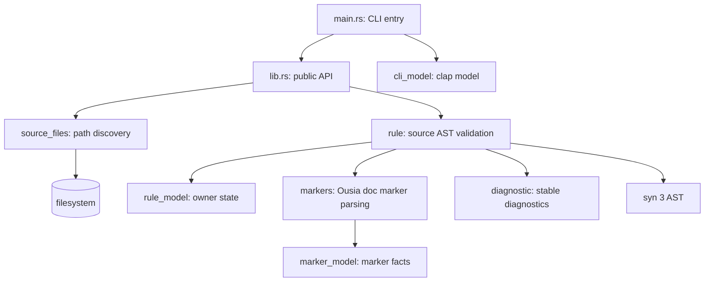

# 01 Rust Checker Owner Refactor

关闭状态：已被后续 Rust checker owner redesign 修正。本文保留为历史 proposal；其中
`*_model.rs` 拆分、model source 独立分发、以及禁止 `const/static` 等支撑项的描述不再是当前
Rust checker 架构权威。当前权威见
`rust-engineering` skill 和 Architecture 中的 Rust checker owner 规则。

## 用户目标

Mode: `refactor`。Target: `code`。

用户要求重构 `.github/skills/rust-engineering/checker`：当前实现把 Rust checker 的诊断模型、文件发现、文件 IO、`syn` 解析、marker 解析、AST 遍历、规则判定和测试夹在一个 `lib.rs` 中；同时用一个 `module-owner` 标注覆盖了类型定义和 `impl` 实现，无法证明 Ousia 要求的正交 owner。

Compatibility: `not-applicable`。checker 尚未发版给外部 API 消费者；本提案不提供旧内部模块形状兼容层，不创建 facade、adapter、bridge 或双写路径。

## 背景与约束

当前主流程是：CLI 通过 `clap` 得到路径，调用 `ousia_rust_checker::check_paths`；库层收集 `.rs` 文件、读取源码、用 `syn` 解析 AST、检查 `doc` attribute marker，返回 `Diagnostic`；CLI 打印诊断并映射 exit code。

必须保留的语义：

- CLI 入口保持薄，只负责参数解析、输出和 exit code。
- 公开库入口继续提供 `check_paths`、`collect_rust_files` 和 `check_source`，除非实现时有直接调用方证据允许收窄。
- marker 仍是可编译的 Rust doc attribute：`ousia: module-owner` 和 `ousia: ownerless-fn`。
- `module-owner` marker 必须实际覆盖至少一个模块级函数；只包含类型、impl、trait、const、use 或测试脚手架的模块不能标记 module owner。
- `module-owner` scope 只能覆盖模块级函数和 inline module；类型、impl、trait、const、static、extern crate、macro 等非函数 owner item 必须拆到模型、配置或 adapter 模块，避免把函数 owner 当成文件级万能归属。普通 `use` 依赖声明不是 owner item，允许留在使用该依赖的函数 owner 模块中。
- 第一版规则范围不扩展：只检查模块级函数 owner 和 marker placement；不检查 `impl` 方法、trait item、extern item 或宏展开产物的 owner 语义。
- checker 自身必须通过自己的规则；release gate 和 installed smoke 继续运行。

当前应继承的部分：`clap` 解析、`syn 3` AST 解析、稳定 `Diagnostic` 展示格式、release 中的 checker self-validation 和 installed smoke。

当前应演进的部分：模块边界和 owner 标注。`lib.rs` 只能作为公开 API 汇聚入口，不能继续拥有所有模型和流程。

当前应停止模仿的部分：把 `module-owner` 当成文件级万能归属；把 unrelated 私有 helper 放在同一个 owner 下；测试只依赖 `super::*` 访问所有内部行为。

## 候选方案

### 方案 A：保守拆文件

把现有 `lib.rs` 按代码块机械拆成 `diagnostic.rs`、`files.rs`、`markers.rs`、`rules.rs`，保留现有函数签名和大部分 helper 形状。

不选择原因：这会减少单文件长度，但容易把旧的隐式耦合原样搬到多个文件。它不能强制说明 `syn::Item` 遍历属于哪个 owner，也不能防止新的通用 helper 继续积累。

### 方案 B：按 checker 数据流重画 owner

把库层拆成一条窄数据流：`source_files` 只拥有路径展开，`diagnostic` 只拥有诊断模型，`markers` 只拥有 Ousia doc marker 解析和 marker placement 类型，`rule` 只拥有 owner 规则判定和 AST traversal，`lib.rs` 只暴露 public API 并编排文件读取到源码检查。

推荐采用。它让每个跨模块调用点都能看见真实 owner，例如 `source_files::collect_rust_files`、`rule::check_source` 和 `Diagnostic::new`。它保留当前行为，但让 checker 自己的 Rust module owner 也能表达真实语义。

### 方案 C：引入 rust-analyzer 或 tree-sitter 作为解析核心

`rust-analyzer` crate 能提供更强 HIR 与 crate graph，`tree-sitter-rust` 能提供快速语法树。

不选择原因：当前规则只需要稳定 Rust AST 与 doc attribute marker。`syn 3` 已满足需求，且 API 稳定、依赖面小。`rust-analyzer` 内部 crate 依赖和版本风险较高；`tree-sitter` 会把 marker 解析降到语法节点遍历，反而削弱本规则的 Rust AST 语义。后续若要跨文件 module graph，可单独评估 `cargo_metadata`，不并入本次重构。

## 推荐模块边界

目标文件：

- `src/lib.rs`：`rust-checker-api` owner。只声明模块、公开 `Diagnostic`、`check_paths`、`collect_rust_files`、`check_source`，并编排文件读取。不得保存 marker 解析、AST 遍历或测试 fixture 主体。
- `src/cli.rs`：CLI 解析函数和薄测试。它不定义 clap model；入口函数用 `ownerless-fn` 明确说明二进制入口边界。
- `src/cli_model.rs`：CLI/clap 数据模型。拥有 `Cli`、subcommand 和参数类型，不声明 module owner。
- `src/diagnostic.rs`：`rust-checker-diagnostic` owner。拥有 `Diagnostic`、`Diagnostic::new`、`Display` 和 stable diagnostic code/message 格式。
- `src/source_files.rs`：`rust-checker-source-files` owner。拥有路径默认值、目录递归、skip path、排序和去重。它只返回 Rust 文件路径，不读取源码内容。
- `src/marker_model.rs`：marker 常量、marker fact 和 placement 类型。模型模块不声明 module owner。
- `src/markers.rs`：`rust-checker-markers` owner。拥有 doc attribute 提取、marker value 解析和 placement 校验函数。它不定义 marker 模型、不产生文件系统错误、不遍历完整 Rust item tree。
- `src/rule_model.rs`：owner traversal 状态模型。模型模块不声明 module owner。
- `src/rule.rs`：`rust-checker-rule` owner。拥有 `check_source`、`syn::parse_file` 错误映射、模块 owner 继承、AST item traversal 和规则诊断。它依赖 `markers`、`rule_model` 和 `diagnostic`，不依赖 `source_files`。
- `src/main.rs`：薄二进制入口。只连接 CLI 解析、库 API、诊断输出和 exit code，入口函数用 `ownerless-fn` 说明边界。

依赖方向：`main -> lib -> source_files/rule -> markers/diagnostic`。`diagnostic` 不依赖其他内部模块。`markers` 不依赖 `rule`。`source_files` 不依赖 `syn`。`rule` 不做目录遍历或 CLI 输出。

## 最终目标状态

- 每个包含模块级函数的 Rust source 文件都有与其真实职责一致的 module owner 或窄 `ownerless-fn` marker；只包含模型类型的文件不声明 module owner。
- `lib.rs` 不再包含 `Diagnostic` 类型定义、marker parsing、AST traversal、path recursion 或大块规则 tests。
- 文件系统副作用只发生在 API 编排读取源码和 `source_files` 的 metadata/read_dir 边界；`rule::check_source` 是纯源码到诊断的可测试函数。
- marker 解析结果由类型表达，避免用裸 string 在 rule 层重复判断 marker 类型。
- 规则测试通过 public 或 owner-visible API 触发语义；内部 marker parsing 可有窄单元测试，但不得让测试复述完整 traversal 实现。
- `.ousia/framework.json`、`test/manifest_test.ts` 和 `smoke/install-smoke.ts` 同步分发新增 Rust checker source 文件。
- `check.rust-functions:self` 覆盖拆分后的全部 checker source。

用户可观察行为保持不变：同样的 CLI 命令、exit code、诊断 code 和成功输出继续工作。

## 验收矩阵

| 目标状态                   | 验收证据                                                                                                                                                                                    |
| -------------------------- | ------------------------------------------------------------------------------------------------------------------------------------------------------------------------------------------- |
| `lib.rs` 只保留 API 编排   | 人工 review `lib.rs` 不含 `syn::Item` match、marker string parsing、`Diagnostic` struct、recursive path traversal                                                                           |
| owner 拆分真实表达职责     | 每个新增 `.rs` 文件有非泛化 module owner，`cargo run --locked --manifest-path .github/skills/rust-engineering/checker/Cargo.toml -- check .github/skills/rust-engineering/checker/src` 通过 |
| source file discovery 独立 | `source_files` 单元测试覆盖空路径默认 `.`、skip `target/.git/node_modules/.vscode`、排序去重                                                                                                |
| marker 解析独立            | `markers` 单元测试覆盖 module-owner、ownerless-fn、unknown `ousia:` marker、空 value 和 wrong placement 分类                                                                                |
| rule 层纯源码检查          | `rule::check_source` 或 public `check_source` 测试覆盖现有 9 个语义案例，diagnostic code 不变                                                                                               |
| module owner 不被滥用      | `rule` 单元测试覆盖无模块级函数报 `rust-module-owner-unused`，混入非函数 owner item 报 `rust-module-owner-mixed-items`，checker self-check 证明自身没有假 owner                             |
| public API/CLI 行为保持    | `cargo test --locked --manifest-path .github/skills/rust-engineering/checker/Cargo.toml` 通过，包括 CLI clap tests                                                                          |
| baseline 分发完整          | `deno task check:workflow` 和 `test/manifest_test.ts` 覆盖新增 checker source assets                                                                                                        |
| installed checker 可执行   | `deno task smoke:install` 在安装目标运行 installed checker self-check                                                                                                                       |
| release gate 闭合          | `deno task release` 通过                                                                                                                                                                    |

## 第一个可实施纵向切片

目标语义：在不改变 checker 对外行为的前提下，把 `Diagnostic`、路径发现、marker 解析和规则检查拆到真实 owner 模块，并让 checker 自身通过 owner 验证。

跨越 owner：CLI entry、public API、source file discovery、diagnostic model、marker parser、rule validator、manifest inventory、installed smoke。

边界 API：

- `diagnostic::Diagnostic` 由 `lib.rs` `pub use`。
- `source_files::collect_rust_files(paths: &[PathBuf]) -> Result<Vec<PathBuf>, std::io::Error>` 由 `lib.rs` `pub use`。
- `rule::check_source(path: impl AsRef<Path>, source: &str) -> Vec<Diagnostic>` 由 `lib.rs` `pub use`。
- `lib::check_paths(paths: &[PathBuf]) -> Result<Vec<Diagnostic>, std::io::Error>` 保持 public orchestration。

允许修改范围：

- `.github/skills/rust-engineering/checker/src/**/*.rs`
- `.github/skills/rust-engineering/checker/Cargo.toml` 和 `Cargo.lock`，仅当模块拆分或测试需要真实依赖调整
- `.ousia/framework.json`
- `test/manifest_test.ts`
- `smoke/install-smoke.ts`
- `deno.json`，仅当验证命令需要同步
- `.ousia/design/architecture/workflow-architecture.md`，仅当稳定结构描述需要回写

排除范围：不扩大 checker 规则到 extern module file、macro expansion、impl/trait owner 语义；不引入 rust-analyzer internal crates、tree-sitter 或 `cargo_metadata`；不改变 CLI flag surface；不创建兼容 facade。

## 实施方案

1. 建立模块骨架：新增 `diagnostic.rs`、`source_files.rs`、`marker_model.rs`、`markers.rs`、`rule_model.rs`、`rule.rs`、`cli.rs` 和 `cli_model.rs`；函数模块写入准确 module owner，模型模块不声明 module owner。`lib.rs` 声明模块和 public exports。
2. 移动诊断模型：把 `Diagnostic` 和 `Display` 移到 `diagnostic`；保持字段、code 和输出格式不变。
3. 移动路径发现：把 `collect_rust_files`、`collect_path`、`skip_path` 移到 `source_files`；测试路径排序、去重和 skip 语义。
4. 移动 marker 解析：把 marker 常量、doc attr 解析、value extraction 和 placement target 类型移到 `markers`；用 enum 表达 marker kind，unknown `ousia:` 由 typed result 暴露给 rule 层诊断。
5. 移动规则检查：把 `check_source`、`check_items`、AST item attr extraction 和 owner 继承放到 `rule`；rule 只调用 `markers` 和 `diagnostic`。
6. 更新 public API 和 CLI：`main.rs` 继续调用 `ousia_rust_checker::check_paths`；CLI tests 不改语义。
7. 更新 manifest 和 smoke：新增 source 文件必须作为 framework tool assets 分发，manifest test 断言 asset id 列表，smoke 断言 installed files 并运行 installed checker。
8. 运行验证并做 implementation review。

## 状态、错误和副作用

- 状态所有权：checker 不持久化状态；运行期可变状态是 `Vec<Diagnostic>` 和文件列表，分别由 API orchestration 和 rule traversal 局部拥有。
- 数据流：`PathBuf inputs -> source_files::collect_rust_files -> fs read_to_string -> rule::check_source -> Vec<Diagnostic> -> CLI output`。
- 副作用边界：目录读取和文件读取只在 `source_files` 与 `lib::check_paths` 发生；规则层纯函数化。
- 错误映射：IO error 保持 `std::io::Error` 由 CLI 映射 exit code 2； Rust parse error 映射为 `rust-parse-error` diagnostic；规则错误映射为稳定 diagnostic code。
- 内部 invariant：`markers` 负责保证 marker 分类唯一，`rule` 不重复解析 marker string。

## Engineering Quality Evidence

- Entry boundary：`main.rs` 只解析 CLI 和映射输出。
- Orchestration owner：`lib::check_paths` 拥有从路径到诊断的库级流程。
- Model boundaries：`diagnostic::Diagnostic` 是诊断模型；`markers` 的 marker enum 是规则输入模型；`syn` AST 不泄漏到 CLI。
- Validation authority：marker 语法和 placement 分类唯一归 `markers`；owner 规则唯一归 `rule`。
- Side-effect boundary：文件系统遍历归 `source_files`，源码读取归 `lib::check_paths`。
- Callable owner/API surface：跨模块调用保留 owner-visible 形式，不引入 `utils` 或聚合 helper。
- Test contract：rule tests 保护用户语义，source/marker tests 保护边界状态，smoke 保护 installed execution。

## 测试策略

- 单元测试：`markers` 覆盖 marker 分类和 placement；`source_files` 覆盖路径发现；`rule` 覆盖现有规则语义和 module-owner unused 失败路径。
- CLI tests：保留 clap parse shape 测试。
- 集成验证：checker self-check 覆盖拆分后的全部 Rust source。
- Smoke：安装目标断言新增 checker source files，并运行 installed checker。
- 失败路径：parse error、missing owner、unused owner、empty owner、empty ownerless reason、wrong placement 和 unknown marker 的 diagnostic code 不变。

## 回滚方式

若重构引入行为漂移，回滚本提案对应的 checker source 拆分、manifest asset 增量和 smoke/test 更新即可。由于不引入兼容 facade 或外部 schema 迁移，回滚不需要数据迁移。

## 剩余风险和 Review Focus

Assumptions:

- 现有 public API 只有 CLI 和测试直接使用；没有已发布外部 consumer 依赖内部 helper。
- 新增 source files 作为 framework tool assets 分发不会超过 prompt budget，因为 tool assets 不进入 prompt route closure。

Open questions:

- `Diagnostic::new` 是否保持 `pub(crate)`，还是为 rule tests 提供更窄的 test helper；实施时按最小公开面选择。
- `markers` 是否直接产生 diagnostics，还是只返回 typed marker facts；推荐后者，避免 diagnostic owner 和 marker owner 混用。

Review focus:

- 是否只是机械拆文件，还是每个模块确实拥有唯一语义。
- `module-owner` 是否仍被用来掩盖类型、impl 和规则混杂。
- `rule` 是否重新变成 fat module，吸收 marker parsing、diagnostic formatting 或 file IO。
- Tests 是否保护真实 checker 行为，而不是复制内部 match 表。
- Manifest、smoke 和 release gate 是否覆盖新增 checker source。

## Implementation Handoff

已推荐方案：按 checker 数据流重画 owner。第一个切片只做模块边界重构和分发清单同步，不扩大规则语义。

实施者应按依赖顺序先建立 `diagnostic/source_files/markers/rule`，再收窄 `lib.rs`，最后同步 manifest、manifest test 和 smoke。必须保持 CLI 命令、exit code、diagnostic code、success output 和 release gate 语义不变。

验证命令：

- `cargo fmt --check --manifest-path .github/skills/rust-engineering/checker/Cargo.toml`
- `cargo check --locked --manifest-path .github/skills/rust-engineering/checker/Cargo.toml`
- `cargo test --locked --manifest-path .github/skills/rust-engineering/checker/Cargo.toml`
- `cargo run --quiet --locked --manifest-path .github/skills/rust-engineering/checker/Cargo.toml -- check .github/skills/rust-engineering/checker/src`
- `deno task release`

Proposal 关闭条件：实现完成、上述验证通过、implementation review 无阻塞 finding，稳定 checker owner 结构回写 Architecture 或确认现有 Architecture 已覆盖，未完成跨文件 module graph 等事项进入新 Proposal 或 `.ousia/pending.md`。
