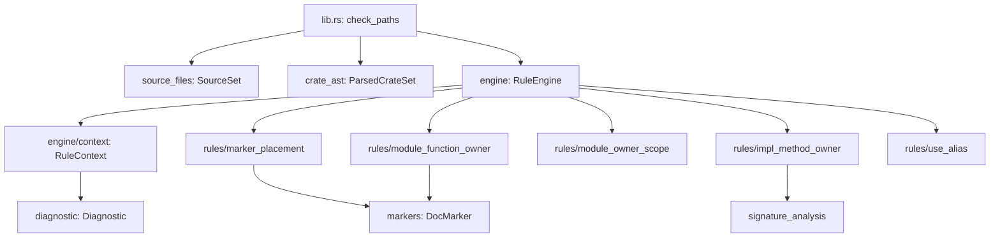

# 02 Rust Checker Rule Framework

关闭状态：已实施并通过 validation 与 implementation review。稳定 rule framework
结构已回写 Architecture；当前权威见
`workflow-architecture.md` 的 Rust checker 条目和 `rust-engineering` skill。

## 用户目标

Mode: `refactor`。Target: `code`。

用户要求把 `.github/skills/rust-engineering/checker` 中的 hard rules 作为统一规则族管理，而不是继续把新规则追加到一个 `OwnerChecker` 中。用户明确希望即使当前 checker 规模不大，也应框架化以提升可维护性、可读性，并调研是否能引入现成 Rust lint framework。

Compatibility: `not-applicable`。checker 仍是 Ousia baseline 内部验证工具；本提案不承诺旧内部模块结构兼容，不创建 facade、adapter、bridge 或双写路径。CLI 命令、diagnostic code、exit code 和 release gate 语义必须保持稳定。

## 背景与约束

当前主流程是：`lib.rs::check_paths` 发现 sources、解析 crate/module tree，然后把每个 `syn::File` 交给 `rule.rs::OwnerChecker::check_file`。`OwnerChecker` 现在同时拥有 AST 遍历、module owner 继承状态、diagnostic sink 和全部 hard rule 语义。

已经存在的 hard rules 包括：

- marker placement 与未知 `ousia:` marker 诊断。
- 模块级函数必须有 module owner 或 ownerless reason。
- module owner 必须实际覆盖函数，且不能覆盖类型、trait、impl 或 re-export。
- impl 方法签名中没有自身类型参与时必须有 ownerless method reason。
- `use ... as ...` alias 禁止，要求同名末级对象通过模块前缀或更完整路径区分。

这些规则的输入大体正交，但共享同一 AST 遍历、module context、marker facts 和 diagnostics。继续把规则方法堆在 `OwnerChecker` 中，会让新增规则缺少固定生命周期，也会让 review 难以判断 rule 是否完整接入 checker、文档和测试。

必须保留的语义：

- `check` 是 hard diagnostic 入口；`report` 仍是 review aid，不承担 hard gate。
- `report function-usage` 可以解析历史或外部代码中的 rename import，但 `check` 禁止新增 alias。
- checker 自身必须通过自己的 hard rules。
- 每条新增 hard rule 必须有 diagnostic code、正反例测试、文档 owner 和验证路线。
- 不为了框架化引入空扩展点、薄包装或隐藏 owner 的通用 helper。

## Reference 调研

### `syn::visit`

`syn` 已经是当前 checker 的解析依赖，并启用了 `full` 与 `visit` features。`syn::visit` 提供 AST traversal hook，适合把“统一遍历”和“规则检查”分开，同时保留现有 source discovery、doc attribute marker、diagnostic code 和测试形态。

采用判断：第一阶段采用 `syn` 作为内部 rule framework 的 AST 基座。是否直接使用 `syn::visit::Visit` 由实现时验证决定；即使保留手写 traversal，也应让 traversal engine 和 rule modules 分离。

### Dylint / Clippy 风格 lint

Dylint 可以运行用户自定义 Rust lints，能力接近 Clippy，适合需要 rustc HIR、类型信息或宏展开后语义的规则。但 Clippy/Dylint 生态依赖 rustc 私有或不稳定 compiler APIs，工具链版本、动态 lint library 和安装复杂度会进入 Ousia baseline validation path。

不选择作为第一阶段原因：当前 hard rules 主要基于 source AST、doc attribute、module owner 继承和 signature 形状，不需要 type checking 或宏展开后语义。现在引入 Dylint 会显著增加工具链风险和发布成本。

### tree-sitter

tree-sitter 适合快速 CST parsing 和 query-style 语法 lint，也适合跨语言检查。但本 checker 需要 Rust AST 层的 doc attributes、impl signature、module tree、Cargo target 和 Ousia marker 语义；tree-sitter 会让这些 owner 协议回落为语法节点匹配。

不选择原因：它不能改善当前规则的语义 owner，反而会增加 AST/CST 双表示和新依赖。

## 候选方案

### 方案 A：保守整理 `OwnerChecker`

保留 `rule.rs::OwnerChecker` 作为唯一检查器，只把大方法拆成更多私有方法，并增加注释说明 rule 分组。

不选择原因：它只能减小函数长度，不能给 rule 生命周期建立统一入口，也不能让 review 快速定位某条 rule 的输入 hook、diagnostic code 和测试证据。

### 方案 B：静态 rule modules + checker engine

新增一个轻量 checker engine，拥有 AST/module traversal、上下文栈和 diagnostic sink。每条 hard rule 成为明确模块或类型，由 engine 在对应 AST hook 调用。第一版不使用动态 registry，不引入 trait object，也不为未来 rule 预建复杂 plugin system。

推荐采用。它承认 hard rules 是稳定变化轴，同时避免为了框架化造一套私有 lint 平台。它能让每条 rule 的 owner、输入、诊断和测试可发现，也能保留共享 context，避免每条 rule 重复遍历 AST。

### 方案 C：Dylint 化 checker

把 Ousia Rust rules 迁移为 Dylint custom lint library，并通过 `cargo dylint` 执行。

不选择原因：当前规则不需要 rustc type context。Dylint 会引入外部 CLI、compiler version matrix 和 dynamic lint library 发布问题；这些成本现在不能被新增能力抵消。该方案保留为未来升级路线：当规则必须依赖 type info、macro expansion 或 HIR 时重新评估。

## 推荐架构

推荐 owner：

- `lib.rs`：public API orchestration。只发现 sources、解析 crate set、调用 `RuleEngine` 和 `FunctionUsageReport`。
- `engine/mod.rs`：checker traversal owner。拥有 file/module/item traversal、test module skip、module owner inheritance 和 rule hook 调度。
- `engine/context.rs`：rule execution context。拥有 path、diagnostics sink、current module facts 和 `emit` API。
- `rules.rs`：rule module registry。只列出静态 rule modules，不保存规则正文。
- `rules/marker_placement.rs`：attribute marker placement 与 unknown marker rule。
- `rules/module_function_owner.rs`：模块级函数 owner 和 ownerless function reason rule。
- `rules/module_owner_scope.rs`：module owner scope mixed-items 和 unused owner rule。
- `rules/impl_method_owner.rs`：impl method self-type signature rule。
- `rules/use_alias.rs`：`use ... as ...` alias forbidden rule。
- `markers.rs`：只拥有 Ousia doc marker parsing 和 marker kind classification。
- `signature_analysis.rs`：只拥有 Rust impl/self type signature analysis。

依赖方向：`lib -> engine -> engine/context/rules -> markers/signature_analysis/diagnostic`。`rules/*` 不发现 files，不解析 Cargo metadata，不打印 CLI output。`markers` 不依赖具体 rule。`diagnostic` 不依赖 checker engine。

## Rule 生命周期协议

每条 hard rule 必须满足：

| 项目                 | 要求                                                                                 |
| -------------------- | ------------------------------------------------------------------------------------ |
| Rule owner           | 有唯一模块或类型拥有 rule 语义，不能散落在 engine traversal 中。                     |
| Diagnostic code      | 每个失败形态有稳定 code，message 说明最小修正方向。                                  |
| Hook input           | 明确从哪些 AST/context hook 触发，例如 file attrs、item、module scope、impl method。 |
| Positive tests       | 至少一个合理代码不报告。                                                             |
| Counterexample tests | 至少一个反例必须报告；没有报告则测试失败。                                           |
| Skill documentation  | `rust-engineering` skill 写明规则语义、禁止/允许形态和 checker code。                |
| Validation           | checker self-check、unit tests 和 release gate 覆盖该 rule。                         |

Engine/context 只拥有共享 traversal 和诊断收集；单条 rule 不得重复 source discovery、Cargo metadata parsing 或 CLI 输出。

## 最终目标状态

- `OwnerChecker` 不再是所有 hard rule 的语义集合；它被 `RuleEngine` 或等价 engine/context 结构替代。
- 每条现有 hard rule 都迁移到 `rules/*` 下的唯一 owner。
- 新增 hard rule 时，维护者可以从 rule module、tests 和 `rust-engineering` 文档看出完整生命周期。
- checker 自身仍通过 `check .github/skills/rust-engineering/checker/Cargo.toml`。
- CLI 命令、diagnostic code、diagnostic display、exit code、`report function-usage` 输出语义不变。
- 不引入 Dylint、tree-sitter、rust-analyzer internal crates 或新的外部 CLI。

## 验收矩阵

| 目标状态              | 验收证据                                                                                                           |
| --------------------- | ------------------------------------------------------------------------------------------------------------------ |
| rule owner 可发现     | `rules/` 下存在按语义命名的 modules；每个现有 diagnostic code 能定位到唯一 rule owner。                            |
| engine 只管遍历调度   | 人工 review `engine/mod.rs` 不含 marker string parsing、signature analysis 主体、具体 rule message 大段拼接。      |
| context 统一诊断输出  | 所有 rules 通过 `RuleContext` 或等价窄 API emit diagnostics，不直接重复 path/line/column 组装。                    |
| 当前语义不漂移        | 现有 checker unit tests 全部通过，diagnostic codes 不变。                                                          |
| 反例测试保留          | 每条现有 hard rule 至少有一个“必须报告才通过”的 counterexample test。                                              |
| alias/report 边界保留 | `check` 继续禁止 `use ... as ...`；`report function-usage` 的 rename import 解析测试继续通过。                     |
| framework 无过度抽象  | 不出现动态 plugin registry、trait object rule list、空 hook 或仅透传 wrapper，除非实现中证明其必要性并有测试支撑。 |
| prompt surface 同步   | `rust-engineering/SKILL.md` 描述 rule 生命周期和 Dylint 升级边界；docs checker 通过。                              |
| release gate 闭合     | `deno task release` 通过。                                                                                         |

## 第一个可实施纵向切片

目标语义：在不改变 checker 对外行为的前提下，先建立最小可运行 rule framework，并用 `use_alias` 这条最正交规则验证 engine、context、rule module 和测试形状；随后逐条迁移剩余 hard rules，使每条 rule 有唯一 owner、统一 context、反例测试和 skill 文档。

跨越 owner：public checker API、AST traversal engine、rule context、现有 hard rules、Rust skill 文档、manifest/smoke asset inventory。

允许修改范围：

- `.github/skills/rust-engineering/checker/src/**/*.rs`
- `.github/skills/rust-engineering/SKILL.md`
- `.ousia/framework.json`
- `test/manifest_test.ts`
- `smoke/install-smoke.ts`

排除范围：

- 不新增 hard rule 语义。
- 不改变 `report function-usage` 输出或内部 resolution 语义。
- 不引入 Dylint、tree-sitter、rust-analyzer 或其他新 lint framework dependency。
- 不改变 CLI command surface、exit code 或 success output。
- 不把 rule framework 做成 dynamic plugin system。

## 实施方案

1. 建立 engine/context 骨架。
   - 新增 `engine/mod.rs`，先承接 `OwnerChecker::check_file`、`check_parsed_file` 和 `check_items` traversal。
   - 新增 `engine/context.rs`，持有 path 和 diagnostics，并提供 `emit` 或等价窄 API。
   - 保留现有 tests，先确保行为不变。

2. 迁移 `use_alias` 作为框架验证切片。
   - 新增 `rules.rs`。
   - 新增 `rules/use_alias.rs`，迁移 `UseTree::Rename` 诊断。
   - 保留普通 alias、`self as alias`、`as _` 和 nested module alias 反例测试。
   - 此步完成条件：只迁移这一条 rule 后，Rust tests 和 checker self-check 仍通过。

3. 迁移 `impl_method_owner`。
   - 新增 `rules/impl_method_owner.rs`，复用 `signature_analysis`。
   - 保留 self-type 正例和 ownerless method reason 反例测试。
   - 此步完成条件：diagnostic code `rust-impl-method-owner-missing` 和 reason 行为不变。

4. 迁移 marker 和 module owner 相关 rules。
   - `marker_placement` 负责 marker target 和 unknown marker。
   - `module_function_owner` 负责 missing owner、ownerless reason。
   - `module_owner_scope` 负责 mixed-items 和 unused owner。
   - 若 module owner 继承状态需要共享，状态留在 engine/context，不复制到单条 rule。

5. 整理测试。
   - 保留现有 rule tests，按 rule owner 分组或迁移到 `rules/*` 附近。
   - 为每条 rule 明确保留 counterexample tests。
   - 避免测试直接复述 traversal dispatch；测试应通过 `RuleEngine::check_file` 或 public checker 入口触发。

6. 同步 framework assets。
   - 新增 checker source files 后更新 `.ousia/framework.json`。
   - 更新 `test/manifest_test.ts` 的 Rust checker asset id 期望。
   - 更新 `smoke/install-smoke.ts` installed file assertions。

7. 同步 `rust-engineering/SKILL.md`。
   - 增加 Rust checker rule lifecycle 段落。
   - 记录 Dylint 升级边界：只有需要 type info、macro expansion 或 rustc HIR 时才重新评估。

8. 验证与 review。
   - 运行 Rust fmt/check/test/self-check。
   - 运行 docs checker。
   - 运行 `deno task release`。
   - 使用 `black-team-review` 做 implementation diff review。

## 状态、错误和副作用

- 状态 owner：`RuleContext` 拥有 diagnostics sink；engine 拥有 traversal-local module context；单条 rule 不保存跨文件全局状态。
- 数据流：`ParsedCrateSet -> RuleEngine -> RuleContext diagnostics -> Vec<Diagnostic>`。
- 副作用边界：rule framework 不新增文件系统或 CLI 副作用；source discovery 和 parsing 仍归现有 owners。
- 错误模型：parse error 仍由 `crate_ast` 映射为 diagnostic；hard rule failure 仍是 `Diagnostic`；IO error 仍从 source discovery/parsing orchestration 返回。
- 内部 invariant：rule modules 不直接构造 path/line/column display；diagnostic formatting 仍归 `diagnostic`。

## Engineering Quality Evidence

- Entry boundary：`lib.rs::check_paths` 仍是 public checker entry。
- Orchestration owner：`engine` 拥有 AST traversal 和 rule scheduling。
- Model boundaries：`RuleContext` 是 rule execution state；`Diagnostic` 是输出 model；`DocMarker` 是 marker fact model。
- Validation authority：每条 hard rule 有唯一 rule owner；engine 不拥有具体 rule semantics。
- Diagnostics contract：diagnostic code 稳定，rule owner 和 message 可定位。
- Test contract：每条 hard rule 有正例和反例测试；release gate 证明 installed checker 可执行。
- Handoff documentation：本 proposal 和 `rust-engineering` skill 说明新增 rule 的接手路径。

## 测试策略

- Unit：每条 rule 的正例和反例测试。
- Integration-like：通过 checker engine 或 public checker entry 触发组合 rules，防止 hook 遗漏。
- CLI：保留现有 clap command tests。
- Self-check：checker 检查自己的 `Cargo.toml` target。
- Release：`deno task release` 覆盖 manifest、smoke 和 docs route。

## 迁移和回滚

迁移按 rule 从正交到耦合逐步进行：先 `use_alias`，再 `impl_method_owner`，最后 module owner 相关 rules。每一步保持现有 tests 通过。

回滚方式：回退新增 `engine/mod.rs`、`engine/context.rs` 和 `rules/*` 文件、恢复 `rule.rs::OwnerChecker` 单体结构，并同步撤回 manifest、manifest test 和 smoke asset 变更。由于不改变外部 CLI 或 persisted state，回滚不需要数据迁移。

## 剩余风险和 Review Focus

Assumptions:

- 当前 hard rules 不需要 type checking、macro expansion 或 rustc HIR。
- 静态 rule modules 足以支撑近期规则增长，不需要 dynamic plugin registry。
- 新增 source files 作为 framework assets 分发不会影响 prompt budget，因为它们是 tool assets。
- 首个整体目标覆盖所有现有 hard rules，实施时必须按 rule 逐步迁移并在每步后运行 Rust tests，避免大爆炸式重构。
- `.ousia/framework.json`、manifest tests 和 smoke asset assertions 只有在新增 source files 后才能最终验证完整性。

Open questions:

- `syn::visit::Visit` 是否比当前手写 traversal 更适合 engine。推荐实施时先做窄 spike：若 module owner 继承和 test-module skip 用手写 traversal 更清楚，则不要为了使用 `Visit` 而牺牲语义可读性。
- 测试应集中在 `rule.rs` 兼容入口，还是移动到 `rules/*` 附近。推荐按 rule owner 放置测试，同时保留少量 engine 组合测试。

Review focus:

- 是否真的形成 rule owner，而不是把 `OwnerChecker` 拆成一堆同样耦合的文件。
- engine 是否开始拥有具体 rule semantics。
- rule context 是否变成无语义的通用容器。
- 是否引入了过度抽象、空 hook、动态 registry 或薄 wrapper。
- 每条已迁移 rule 是否仍有正例和必须报告的反例测试，且 diagnostic code 不变。
- 是否遗漏 manifest/smoke asset 更新。
- `report` 和 `check` 的语义边界是否保持。

## Implementation Handoff

推荐方案：静态 rule modules + checker engine。先建立最小 engine/context，再逐条迁移现有 hard rules。不要引入外部 lint framework；Dylint 只作为未来 type-aware rule 的升级候选。

验证命令：

- `cargo fmt --check --manifest-path .github/skills/rust-engineering/checker/Cargo.toml`
- `cargo check --locked --manifest-path .github/skills/rust-engineering/checker/Cargo.toml`
- `cargo test --locked --manifest-path .github/skills/rust-engineering/checker/Cargo.toml`
- `cargo run --quiet --locked --manifest-path .github/skills/rust-engineering/checker/Cargo.toml -- check .github/skills/rust-engineering/checker/Cargo.toml`
- `deno task --cwd .github/skills/doc-validation check:docs`
- `deno task release`

Proposal 关闭条件：implementation 完成、上述验证通过、implementation review 无阻塞 finding、稳定 rule framework 结论回写 Architecture 或确认 Architecture 已覆盖，未实施的 Dylint/type-aware rule 评估进入后续 Proposal 或 `.ousia/pending.md`。
