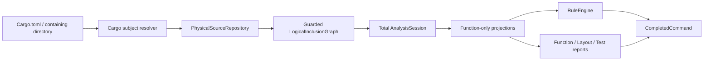
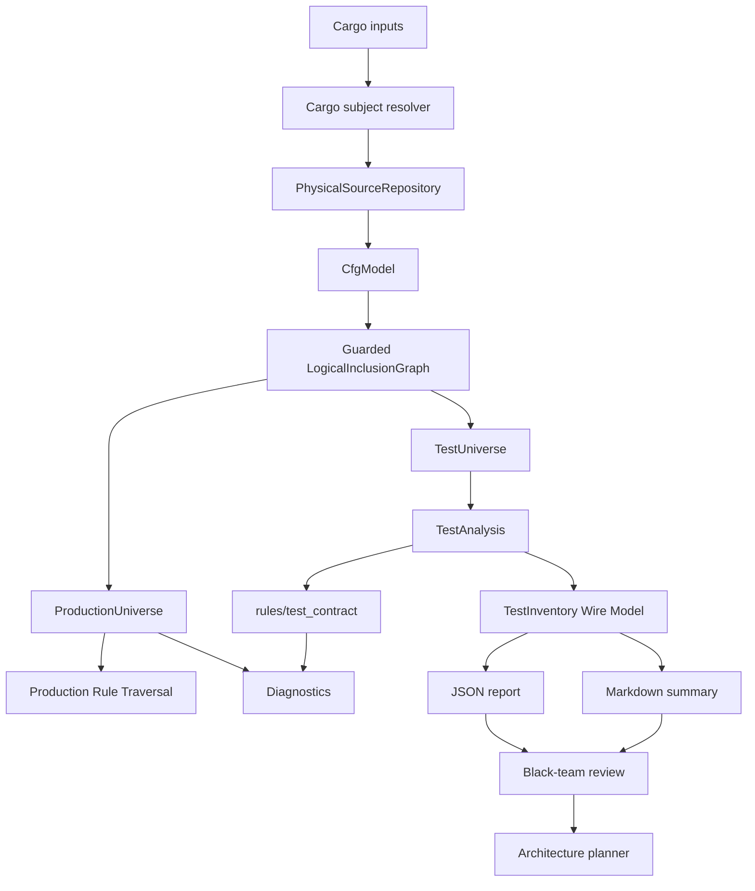

# 04 Rust 测试契约与治理

## 实施结局

Cargo-only subject、total `AnalysisSession`、guarded logical graph、稳定item/member
identity、ordered attributes、shared callable/import/usage facts、mandatory GSS、rstest
case/template placement、typed issues和versioned inventory已经落地。Function usage将direct
call与source-visible function value reference统一计为used，但对外TSV不增加分类列。

Guarded alias/type association、完整`LexicalScopes`、Production/Test双universe、Cargo package
identity和Markdown package/target/module/Scope分组已经闭合。已知本地glob frontier降级为uncertainty
的最终review finding已由`TypeFactIndex`唯一owner修复；刷新后的artifact和20个candidate stable keys
已逐组人工结算，最终implementation review确认可关闭并归档。

## 用户目标

Mode: `refactor`。Target: `code`。Compatibility: `forbidden`。

本提案要把 Rust 测试从容易由 AI 无限制复制的代码集合，收敛为可强制、可盘点、
可比较和可持续重构的测试证据。所有受支持的 source-declared Rust tests 必须声明
`Goal`、`Scope` 和 `Semantics`（GSS）；同一 owner、调用边界和成功或失败不变量下，
只有输入与期望变化的矩阵必须使用命名 `rstest` cases；checker 同时输出稳定 JSON
inventory 和由同一模型渲染的 Markdown 摘要，供 review 判断测试应删除、拆分、合并
或迁移。

`forbidden` 表示新 baseline 立即拒绝没有 GSS 的宿主 Rust tests，不提供旧格式
parser、warn-only 模式、迁移 facade 或双行为验证入口。Installer 不修改宿主项目的
`Cargo.toml`；项目采用矩阵测试时自行拥有 `rstest` 版本、features 和 MSRV 决策。

Installed host gate 使用 validation route `check.rust`，命令固定为
`checker check-project .`。`analysis::subject` 是把宿主根解析为Cargo inputs或not-applicable的唯一
owner：root-level `Cargo.toml` 存在时只返回该manifest；不存在时读取`.ousia/project.json`的可选
`project.rust.sourcePaths`。

`sourcePaths`是project-root-relative string array，只接受存在的`Cargo.toml`或当前层直接包含
`Cargo.toml`的目录，不接受glob、普通文件、`.rs`、manifestless directory、绝对路径或逃出project
root的`..`。Resolver规范化、排序、去重后交给Cargo subject resolution。字段absent或空数组表示
Rust validation not-applicable并exit 0；字段类型/路径非法是configuration error并exit 2。普通
`checker check [CARGO_INPUT...]`和report CLI不读取Ousia project facts。

Checker自身另由仓库根 `deno.json` 的 release-only task
`check.rust-checker-self` 检查 `.github/skills/rust-engineering/checker/Cargo.toml`；它不进入
installed manifest。旧 `check.rust-functions` route和task被替换，不保留 alias。

## 实施前结构与问题

提案进入实施前，Rust checker 的主流程是：



实施前结构已经删除旧`SourceSet`、`ParsedCrateSet`和`ParsePolicy`。Subject resolver在root
identity分配前执行semantic dedup；guarded graph证明每个可达module declaration都被现存source
alternatives覆盖，并以root/target、declaration lineage和canonical alternative生成structural
occurrence identity。当时尚未闭合的边界是：

- production projection只完整覆盖module functions，impl、trait、foreign、use和calls仍由
  consumers读取裸AST，无法保证item/caller/import/callee guard correlation；
- rstest facts尚未用一个有序event model表达case前buffer、template defaults、parameter
  placement与conditional ignore SAT。

这些实施前问题不是缺少几个skip条件。继续扩充`FunctionProjection`、在engine/report分别解析
attributes，或用optional fields建立巨型item model，都会重新产生第二份语义owner。
当前测试盘点和治理结论必须由修正后的V1 inventory生成，不在提案正文保存易过期数量。

## GSS 协议

测试 item 使用连续 doc comments：

```rust
/// Goal: reject a stale plan before any target write.
/// Scope: level=integration; boundary=applier::apply_plan.
/// Semantics: returns a stale-plan error and leaves target bytes and manifest unchanged.
#[test]
fn stale_plan_is_rejected() {
    // ...
}
```

Hard semantics：

- 字段顺序固定为 `Goal`、`Scope`、`Semantics`，各恰好一次。
- 字段值 trim 后非空。Placeholder 是封闭集合，trim 并 ASCII case-fold 后拒绝
  `todo`、`tbd`、`n/a`、`...`、`<goal>`、`<scope>`、`<semantics>` 和
  `placeholder`。
- `Scope` 必须包含唯一 `level` 和 `boundary`；level 只允许 `unit`、`module`、
  `integration`、`contract` 或 `smoke`，boundary 必须是非空 owner-visible API 或
  module path。
- 测试 function 上的全部 doc attributes 都属于 GSS，不允许额外 rustdoc 摘要。忽略
  夹在 doc attributes 之间的非 doc attributes 后，必须恰好有三个直接 literal-string
  doc attributes：第一条 Goal，第二条 Scope，第三条 Semantics。普通 `//`、item 外注释
  和函数体中的注释不属于契约。
- 一条 source-level `rstest` function 共享一份 GSS；每个 case label 表达具体输入
  语义。Scope 或不变量不同的 cases 必须拆为不同测试。
- Goal 和 Semantics 保持自然语言 opaque value。Checker 不使用最低字数、关键词词表、
  embedding 或 LLM 作为 hard gate。

最小 grammar：

- `Goal` 和 `Semantics` 接受 trim 后的非空 UTF-8 文本。V1 不接受 continuation；需要
  多行自然语言时在单个 `#[doc = "..."]` literal value 中表达。
- `Scope` 精确使用 `level=<level>; boundary=<boundary>`；分号两侧可有空白，不接受
  未知 key、重复 key、缺 key 或空 value。
- `boundary` 是由 reviewer 解释的 owner-visible API/module path 文本；checker 只证明
  grammar 与非空，不宣称已证明 owner 真实性。
- Doc attributes 和测试 attributes 之间可以出现其他非 doc attributes；parser 按同一
  function item 上 doc attributes 的 source order 校验上述唯一序列。
- `#[doc = concat!(...)]`、`#[cfg_attr(..., doc = ...)]`、未知字段前缀和第四条 doc
  attribute 均产生 `rust-test-contract-carrier-invalid`，定位非法 attribute。V1 不求值
  conditional doc，也不接受第二种 carrier。

Level 语义由 `test-engineering` 拥有，checker 只验证 vocabulary：

- `unit`：通过一个 type/function/validation owner 的本地 API 保护单一行为，不跨文件
  系统、进程、Cargo metadata 或外部系统边界。
- `module`：通过一个 Rust module/subsystem API 保护同一模块内多个行为的协作，不跨
  crate target 或 OS side-effect boundary。
- `integration`：跨 module、crate target、Cargo metadata、文件系统、进程或外部依赖
  边界验证协作。
- `contract`：验证稳定 syntax、protocol、diagnostic code、JSON/Markdown schema 或
  public API contract；即使实现使用 integration fixture，契约目的优先归 `contract`。
- `smoke`：只证明 installed/executable end-to-end path 连通，不作为深层行为证据。

选择优先级为 `smoke > contract > integration > module > unit`。Checker 不验证作者选择
是否真实，inventory/review 必须结合 direct calls 和 oracle evidence 复核。

### V1 测试全集

V1 hard contract 覆盖下表中可由未展开 source AST 识别的 test function：

- 带内建 `#[test]` 的 function。
- 带 `#[rstest]` 或 `#[rstest::rstest]` 的 function。
- 带 attribute path 末段为 `test` 的 function，例如 `#[tokio::test]`、
  `#[async_std::test]`、`#[actix_rt::test]`、`#[sqlx::test]` 和项目自定义 test
  attribute。该判定与 `rstest` 的 implicit test attribute 语义一致。
- `#[cfg_attr(..., test)]` 或 `#[cfg_attr(..., path::test)]` 中 source-declared test
  attribute 的 function；checker保留conditional guard，并只在item reachability与carrier
  activation合取可满足时纳入`TestUniverse`。
- Cargo targets按封闭矩阵处理：

| 输入或 target kind                              | V1 行为                                                                                                 |
| ----------------------------------------------- | ------------------------------------------------------------------------------------------------------- |
| 任一已知 Cargo target 且 `Target.test == true`  | Include；发现 source test functions 并强制契约。                                                        |
| 任一已知 Cargo target 且 `Target.test == false` | Exclude；遵循 Cargo 的实际 default test-enabled 配置。                                                  |
| `custom-build`                                  | Exclude；build script 不属于 libtest source-test universe，即使 metadata 声称 test-enabled。            |
| 未知 target kind                                | Fatal capability error；不静默 include 或 exclude。                                                     |
| 含 Cargo manifest 的目录                        | 按 Cargo metadata targets 处理，不额外递归 raw fixture files。                                          |
| 单个 `.rs`、普通文件或manifestless directory    | Subject fatal；输入必须是manifest或当前层直接含manifest的目录。                                         |

明确排除：doctest/`compile_fail` code blocks、function-like macro 生成的 tests、宏展开后
才出现的 hidden tests、Cargo targets未包含的UI fixture文件和没有 source function
的 property-test macro。`bench` 只在 `Target.test == true` 时作为 source-test target进入；
这不等于盘点 benchmark harness。报告必须列出这一 capability boundary；不得使用“所有
runtime tests”措辞。

Cargo target role 归一化为 `lib`、`bin`、`test`、`example`、`bench`、`proc-macro`：
`lib`、`rlib`、`dylib`、`cdylib` 和 `staticlib` 都报告为 `lib`；`proc-macro` 保持独立。
一个 target 出现多个 library crate types 时仍只有一个 root/test identity。`Target.test`
是 universe 的权威开关；V1 不声称复现 custom harness 的 runtime test enumeration。

成功session始终来自Cargo metadata target并拥有authoritative logical module graph。同一physical
source可以被多个Cargo target或`#[path]` logical modules引用；physical读取/parse去重不能删除
logical occurrences。

Attribute path末段为 `test` 但实际不是测试的API与本协议冲突，必须重命名；V1不提供
suppression。`cfg`/`cfg_attr`由共享 `CfgModel` 结构化解析，test domain只消费投影后的exact
attribute head、activation和placement。Relevant payload可确认head但body非法时保留test
candidate并产生`rust-test-attribute-invalid`；无法确认head时不使用substring或token搜索猜测。

### 反模板化治理门

Hard rules 只能证明 GSS 结构。Strict gate 启用前，inventory V1 还必须提供：

- 每个测试的直接调用路径集合。
- assertion、panic、`Result` propagation 和 expected diagnostic/error literal 等 oracle
  facts。
- 当前测试模板总数、按 target/module/Scope 的分布。
- exact-body clone、仅 literal/expected 变化的 matrix candidate、一个测试内多个
  production-call family 的 multi-contract candidate，以及没有可见 oracle 的 weak-oracle
  candidate。

Rust test diff 的 implementation review 必须消费 JSON 或 Markdown inventory，逐项核对
新增/删除测试、GSS 与 direct-call/oracle evidence、candidate groups 和测试数量变化。
Review 不通过时不得以 checker success 替代语义验收。这是 strict rollout 的组成部分，
不是后续可选优化。

GSS 进入测试项 rustdoc 是有意选择的治理表面。未来若要更换 carrier，必须通过新提案
迁移，不能同时接受两种格式。

## `rstest` 采用策略

### 推荐政策

当两个或更多用例保护同一 owner、同一调用边界、同一成功条件或失败不变量，且只有
输入与期望结果变化时，必须使用 `rstest` named cases。不同 owner、副作用、共同
状态、调用顺序或失败不变量必须保持独立测试。单场景继续使用原生 `#[test]`。

Checker 阻止可精确证明的无价值形状：

- 零参数且没有 case、fixture、context、trace、timeout 或 test-attr 等能力的
  `#[rstest]`。
- 两个或更多显式 cases 中存在 unnamed case。
- 同一 template 中重复 case label。
- Test-level `#[ignore]` 没有 reason；rstest parameter-level `#[ignore]` 不属于该
  规则。

Test-level和case-bound ignore只接受 `#[ignore = "non-empty reason"]`，reason trim后还必须
通过 GSS placeholder集合。Bare、non-literal、empty或重复 ignore产生
`rust-test-ignore-reason`。`#[cfg_attr(C, ignore = "reason")]`结构化保留guard `C`并继承wrapper
所在的template/case binding；malformed conditional payload产生`rust-test-attribute-invalid`。
Parameter-level `#[ignore]` 按attribute placement排除，不进入skip reason规则。

手写 loop、case array 或相邻同构测试只能作为 matrix candidate，不能直接 hard
fail；它们可能共同证明顺序、隔离、coexistence 或共享状态。

`rstest` 形态分为：

- 两个或更多显式 `#[case]`：behavioral table，所有 cases 必须使用唯一语义 label。
- `#[values]` / `#[files]`：V1 禁止。它们不能为每个组合提供用户要求的语义 label，且
  files glob 的 runtime/rebuild identity 不稳定。需要这些能力时先扩展 contract carrier
  和 report schema，不能绕过 named-case policy。
- Fixture-only、context、trace 或 timeout：单场景能力例外，允许使用 `rstest`，但 review
  必须证明该能力真实减少重复或集中生命周期，而不是为了表面统一。
- Fixture capability 是至少一个既非 `#[case]` 也非 `#[context]`/`#[ignore]` 的 function
  parameter，由 rstest 按参数名或 `#[from]`/`#[with]` 注入。Function-level `#[trace]`、
  `#[timeout]`、`#[test_attr]` 和 parameter-level `#[context]` 也属于能力。
- 一个显式 case 不能构成矩阵；如果没有 fixture/context/trace/timeout/test-attr 等其他
  能力，按 `rust-rstest-no-capability` hard fail。
- 零参数且没有上述任何 `rstest` 能力的 `#[rstest]` hard fail，使用原生 `#[test]`。
- Parameter-level `#[values]` 和 `#[files]` 必须先于 fixture 分类识别，分别产生
  `rust-rstest-values-forbidden` 和 `rust-rstest-files-forbidden`。
- V1 只接受独立 function-level `#[case::label(...)]` attributes。`rstest(...)` 内嵌
  compact cases 产生 `rust-rstest-compact-case-unsupported`；
  `#[cfg_attr(..., case...)]` 产生 `rust-rstest-conditional-case-unsupported`。两者均不进入
  declared case count，避免 report 假装已完整理解另一套 case grammar。

“同契约多输入必须使用 rstest”是 `test-engineering` 的 review-enforced policy。Checker
只对已采用 rstest 的精确形状 hard fail，并通过 matrix candidates 暴露可能仍在手写的
矩阵；不能声称已机械证明 owner、边界和失败不变量相同。

### 外部事实

提案编写时最新稳定 `rstest` 为 `0.26.1`，声明 Rust 1.70，提供 fixtures、named
cases、values、files、async inputs、timeout 和 trace。未发布主线已提高 MSRV，说明
版本事实不能进入长期 Architecture。Checker 自身只需要 cases/fixtures，采用时优先
关闭默认 features，并记录 clean/incremental test build evidence。

`rstest` 为每个 case 生成独立 libtest test。该能力改善矩阵失败定位，也会按 case
数量增加宏展开和编译工作；与 async runtime attributes 或大笛卡尔积组合时成本尤其
明显。因此本提案不设置通用 case 阈值，但 inventory 必须报告矩阵规模。

## 候选方案

### 方案 A：只依赖测试名和人工 review

不选择。它不能阻止 AI 生成没有契约的测试，也不能提供稳定 inventory 和增量比较。

### 方案 B：强制普通 body comments

不选择。普通注释需要保留 source 并实现 trivia attachment；用户选择 doc comments，
`syn` 已能提供稳定 item attachment 和 span。

### 方案 C：所有测试统一使用 `rstest`

不选择。当前大部分测试是无参数单场景，机械改写不会改善语义、失败粒度或 fixture
透明度，却会增加 proc-macro invocation、依赖和 IDE/diagnostic 边界。

### 方案 D：GSS doc comments、矩阵 `rstest`、共享 inventory

推荐。`test-engineering` 继续拥有测试语义，`rust-engineering` 拥有 Rust carrier 和
checker projection；hard rules 与 report 共享确定性 inventory，而 review 继续拥有
自然语言真实性和删除、拆分、合并结论。

### 方案 E：Checker 内嵌 NLP、embedding 或测试质量数据库

不选择。该方向不确定、难版本化，会让 checker 变成第二套语义平台。V1 保持无状态
静态分析；baseline compare、动态 runner、coverage 和 mutation evidence 需要后续独立
提案。

## 架构方案比较

### 方案 F：继续扩展单一 `ParsedModule`

改动最小，但physical source、logical occurrence、target、cfg、parse result仍共享一个类型；
每个新能力都会继续增加布尔组合。不选择。

### 方案 G：双graph共享source cache

分别构建production/test graph可以简化consumer，但module resolution执行两次、跨graph
identity复杂且policy容易漂移。未来使用具体rustc invocation时可重新评估，当前不选择。

### 方案 H：physical repository + logical graph + universe projection

选择。物理读取/parse、Rust module occurrence和production/test policy分别有唯一owner；
同一source可复用而logical occurrence不会丢失。复杂度来自Rust本身的两个identity，而非新增
目录层。

### 方案 I：直接迁移rustc/HIR或rust-analyzer

暂不选择。它会引入toolchain、Cargo cfg、proc-macro和compilation invocation边界，但GSS和
rstest shape仍是source-level规则。只有规则真正需要type information或macro expansion时再
替换frontend。

## 推荐架构



目标 owner：

- `analysis::subject`：将Cargo inputs解析为Cargo targets，不读源码；每个显式输入必须成功分类或fatal。
- `PhysicalSourceRepository`：canonical physical identity、读取、parse cache和source fatal error。
- `LogicalInclusionGraph`：inline/out-of-line module occurrence、`#[path]` resolution、cycle、
  ambiguity和logical identity。
- `CfgModel`：`cfg`/`cfg_attr` grammar与production/test reachability；consumer不识别test context。
- `AnalysisSession`：只有完整source和graph成功后才能创建，是所有evaluation的只读输入。
- `test_analysis.rs`：aggregate orchestration，只组装相邻领域facts。
- `test_analysis::contract/shape/facts/fingerprint/candidates`：分别拥有GSS、rstest placement、
  source-visible facts、fingerprint和candidate语义；typed issues归`test_analysis::issues`。
- `rules/test_contract`：只把test analysis issues映射为稳定hard diagnostics。
- `report/test_inventory`：只渲染 inventory 和 candidate groups，不
  重新解析源码或发明语义。
- `black-team-review`：根据 GSS、真实调用边界和候选 evidence 判断是否需要重构。

Production function-owner rules只接收`ProductionUniverse`，test analysis只接收
`TestUniverse`；两者不再自行判断target kind、`cfg(test)`或test context。Reachability采用
possibility semantics：cfg保留为共享atom的布尔表达式，`test`分别代入false/true，其他
feature/custom predicate保留为symbolic atoms；target/platform predicates由当前checker调用环境的
`rustc --print cfg`结果代入，避免把`unix`与`windows`等不可能平台组合当成可满足。调用失败属于
`cfg-environment` fatal；report记录rustc cfg digest，不输出绝对toolchain路径。随后通过有限布尔可满足性判断
`impossible`、`possible`或`always`，而不是对每个atom独立三值传播。多个`cfg` attributes
合取；`cfg_attr(C, A)`保留guard `C`及其否定分支。V1只处理source实际出现的布尔atoms，
不读取Cargo feature assignment，也不声称盘点其他target platform。`#[cfg_attr(feature = "x", test)]`同时是
production-possible regular function和test-possible candidate，不能压成单个`is_test`布尔值。
宏展开生成的隐藏tests只形成coverage warning。

Item投影保持reachability与carrier activation共享同一atom identity。对item guard $R$和所有
test carriers的activation析取 $T$，production regular occurrence由
$\mathrm{sat}(R[test=false] \land \neg T[test=false])$判定，test occurrence由
$\mathrm{sat}(R[test=true] \land T[test=true])$判定。多个carrier只构造typed析取；consumer
只能消费projection result，不能重新扫描attributes。该关联避免互斥guard被拆成两个独立
`possible`后制造不存在的test。

SAT只处理该source item/module attribute产生的有限表达式，使用canonical simplification和
deterministic atom order。V1固定每个effective expression最多256 nodes、16个symbolic atoms和
65,536个assignments；逐assignment短路求值，不使用wall-clock timeout。每个session最多
100,000个canonical query，query result按canonical expression memoize；超过任一上限返回
`model-budget-exhausted` fatal，不降级为unknown或静默include。所有上限与计费scope进入
`analysis.cfg_budget`，adversarial fixtures冻结边界行为。

### Logical graph不变量

- `SourceId`标识canonical physical source；`OccurrenceId`由subject/target、parent occurrence、
  declaration ordinal和logical module name组成，不按physical path去重。
- Out-of-line occurrence以`SourceId + full-file body`定位；inline occurrence以parent
  occurrence、source item path和declaration ordinal定位body。同一physical AST可服务多个
  occurrences。
- Module edge携带reachability和conditional `path` alternatives。Graph builder先使用
  `CfgModel`解析影响inclusion的attributes，再建立guarded edges。
- DFS状态携带累计guard $G$；cycle key是当前ancestry中的full-file
  `BodyLocator`/`SourceId`。只有closing edge与累计guard及当前universe constraint的合取可满足
  才fatal；互斥guard不构成cycle。Inline body自身不能形成out-of-line read cycle。Siblings不共享
  ancestry，因此合法引用同一source不是cycle。Memo key是body locator、canonical guard和
  universe，消费同一session query budget。
- Conditional `path` alternatives始终包含默认resolution分支，其guard是所有path guards的
  否定；两个alternatives只有在其guards合取可满足时才构成ambiguity。
- 对任一universe为possible/always的module declaration，零个source candidate是missing
  fatal；默认resolution中`foo.rs`与`foo/mod.rs`guards可同时满足时是ambiguity fatal；确定
  impossible的edge不要求source存在。Missing按guarded candidate set和具体universe projection
  判定。

### Total analysis与错误模型

`AnalysisSession`内部不保存`Result<syn::File, ParseFailure>`。Subject、Cargo metadata、source
read、parse、cfg environment、module graph、model identity或render失败返回typed `FatalError`并exit 2；hard
violations只有在完整session上evaluation后才exit 1；invalid test contracts仍可进入完整report并
exit 0。`main.rs`是唯一输出commit boundary；subject/read/parse/graph/model/render fatal发生在
commit前，stdout为空且不提交partial diagnostics、JSON、Markdown或TSV。所有成功/invalid
evaluation先构建`CompletedCommand { stdout, stderr, exit_code: 0|1 }`；reports的capability
warnings进入其稳定payload，check diagnostics进入stderr。CLI固定先写stdout再写stderr；任一sink
write failure归`output-commit` fatal，允许操作系统已接收不可回滚的前缀并exit 2。Pre-commit
fatal只生成单一fatal stderr payload。

### Typed test attribute model

每个function只构建一次`FunctionAttributeFacts`。GSS contract status与rstest shape status分开；
内部`TestIssueCode`为封闭enum并映射本提案的16个外部codes。Rstest按0.26.1源码顺序语义建模：
case前buffer绑定该case，最后case后的attributes属于template defaults；function/test-level、
case-specific和parameter-level placement不得混用。禁止以`.contains("case")`、
`.contains("ignore")`或identifier搜索承担语义。

Ignore placement使用同一reason协议但不同binding：plain test及最后case后的ignore属于
template/test-level；case前buffer中的ignore属于该case；两者都必须是唯一、literal、非空且非
placeholder reason。Parameter-level `#[ignore]`是rstest injection role，不属于test skip，也不
检查reason。Conditional ignore继承wrapper所在的template或case binding。唯一性按最终emitted
test occurrence判断：每个rstest case合并case-bound与template defaults，只有两个effective
ignore guards可同时满足时才报duplicate；diagnostic保留所有冲突attribute spans与activations。

### Guarded type关联与词法作用域

`TypeFactIndex`唯一拥有type definition、alias、import与impl target关联。Alias RHS先保留定义module、
source path segments、item identity和effective guard，再由私有有界worklist解析；不在收集时一跳
转成lexical path，也不创建report-local或通用name resolver。

- 每个impl target从impl effective guard开始；经过named import或alias edge时合取edge guard，命中
  nominal type后再合取type definition guard，并用`CfgModel`在Production universe裁剪。
- 相同最终`TypeKey`合并；不同targets的guards可同时满足时为`Ambiguous`，互斥时各自exact关联。
- `Unresolved`只来自结构化frontier：alias cycle、可达alias/import分支没有nominal terminal，或glob
  导出无法证明。Uncertainty保存reason、guard和结构上相关的`TypeKey`集合；只抑制其guard与
  uncertainty guard可同时满足的相关type fact，不按末级文本扫描整个Cargo target。
- Alias cycle用`ItemId`终止。Worklist只遍历已收集的alias/import/nominal edges；SAT预算仍由
  `CfgModel`拥有，预算耗尽保持fatal exit 2。
- `GuardedUseIndex`只保存named/glob use syntax、source path和guard。已知本地glob module可以扩展
  frontier；无法证明module时只产生aggregate capability warning，不抑制无关candidate。
- `TypeFactIndex`只输出结构化association uncertainty facts。`zero-field-types` reporter拥有wire
  codes、每类聚合一条、按code排序和序列化；codes固定为`type-association-ambiguous`、
  `type-association-unresolved`和`external-glob-not-resolved`。

`CallableIndex`内的私有`LexicalScopes`只保存按namespace分类的guarded blockers，并回答当前region
中的blocker guard；它不返回definition、module path、import target或callable，也不消费
`GuardedUseIndex`。Namespace封闭为`BareValue`与`PathHead`：patterns、parameters、local function、
const和static阻止bare value；module、trait、enum、union和type alias阻止path head；所有struct阻止
path head，tuple/unit struct还阻止bare value；显式local use保守阻止两者，impl与macro不声明
blocker。

Function/closure inputs、`let`/`let-else`、`if let`/`while let` condition chain、match arm与guard、
`for` pattern、nested block和block item预声明按Rust source order进入和退出region。Block-local item
body始终截断，不归入enclosing callable；预声明名称不等于遍历body。

`UsageVisitor`只生成同一组guarded syntax facts。Production function usage以caller effective guard为
seed并在Production universe投影。Test `BodyFacts`以item effective guard与所有已识别test carrier
activations的析取合取为seed，包括head可确认但`valid_shape == false`的carrier；shape validity只产生
issue，不决定test occurrence是否存在。再合取nested expression guard和可见blocker guard的否定；只有完整
guard在Test universe可满足的usage进入inventory。不得为`BodyFacts`建立第二个字符串visitor。

## Hard diagnostics

GSS：

- `rust-test-contract-missing`
- `rust-test-contract-field-order`
- `rust-test-contract-duplicate-field`
- `rust-test-contract-empty-field`
- `rust-test-contract-placeholder`
- `rust-test-contract-scope-invalid`
- `rust-test-contract-carrier-invalid`
- `rust-test-attribute-invalid`

测试形状：

- `rust-rstest-no-capability`
- `rust-rstest-case-label-missing`
- `rust-rstest-case-label-duplicate`
- `rust-rstest-values-forbidden`
- `rust-rstest-files-forbidden`
- `rust-rstest-compact-case-unsupported`
- `rust-rstest-conditional-case-unsupported`
- `rust-test-ignore-reason`

Hard gate 不按测试总数、rstest 占比、文本长度、关键词、assertion count、coverage
overlap 或候选 fingerprint 失败，也不自动删除、合并或重写测试。

## Inventory 与摘要

CLI：

- `checker report test-inventory --format json [CARGO_INPUT...]`
- `checker report test-inventory --format markdown [CARGO_INPUT...]`

JSON 是版本化权威格式。仓库尚未发布包含test inventory的tag或release；首次发布前直接修正并
冻结V1，不创建V2或V1 adapter。若发现已有外部发布证据，停止实施并重新决定schema版本。V1顶层固定为
`schema_version`、`report_kind`、`subject`、
`analysis`、`capabilities`、`summary`、`tests`、`candidate_groups` 和 `warnings`：

- `schema_version` 固定为 `ousia.rust-test-inventory.v1`。
- `subject`包含Cargo input root identity，以manifest-relative package/target identity为稳定根。重复
  manifest locator在identity分配前去重。多个Cargo manifests若产生相同package/target/
  manifest-relative projection但canonical manifests不同，在identity分配前返回typed
  `subject-root-ambiguous` fatal，不任取input ordinal消歧。
- `tests` 中每项包含稳定 `test_id`、root/target/module/path/line/name、template kind、test
  attributes、结构化 GSS、rstest cases/capabilities、direct calls、oracle facts 和
  exact/normalized fingerprints。
- `candidate_groups` 每项包含稳定 code、`confidence`、test IDs 和确定性 evidence；V1 不
  计算自然语言相似度。
- `capabilities` 明确 source AST 已收集、macro expansion/runtime/coverage/mutation 未收集。

稳定 ID 由root identity、Cargo target kind/name、source-relative path、module path和
function name组成；同一`analysis` configuration下重复ID是checker error。输出不含
timestamp、hostname、PID或绝对checkout root，所有数组按稳定ID排序。跨checkout byte stability只
承诺root projection无碰撞且manifest/package-relative locators不变的Cargo inputs；Cargo projection
collision明确fatal。

V1 字段结构如下；全部字段必填，不适用 collection 使用空数组，不省略字段：

```json
{
  "schema_version": "ousia.rust-test-inventory.v1",
  "report_kind": "rust-test-inventory",
  "subject": {
    "roots": [{ "root_id": "...", "kind": "cargo", "path": "..." }]
  },
  "analysis": {
    "universe_policy": "cargo-metadata-test-enabled-v1",
    "cfg_evaluation": "symbolic-test-projection-v1",
    "rustc_cfg_sha256": "...",
    "cfg_budget": {
      "nodes_per_expression": 256,
      "atoms_per_expression": 16,
      "assignments_per_expression": 65536,
      "queries_per_session": 100000
    },
    "target_normalization": "cargo-metadata-0.21-v1",
    "path_normalization": "root-relative-forward-slash-v1",
    "fingerprint_algorithm": "rust-token-shape-sha256-v1"
  },
  "capabilities": {
    "source_ast": "collected",
    "macro_expansion": "not_collected",
    "runtime_inventory": "not_collected",
    "coverage": "not_collected",
    "mutation": "not_collected"
  },
  "summary": {
    "tests": 0,
    "contracts_complete": 0,
    "contracts_invalid": 0,
    "shapes_valid": 0,
    "shapes_invalid": 0,
    "plain_tests": 0,
    "rstest_templates": 0,
    "declared_cases": 0
  },
  "tests": [
    {
      "test_id": "...",
      "occurrence_id": "...",
      "root_id": "...",
      "package": {
        "name": "...",
        "manifest": "..."
      },
      "target": {
        "kind": "lib|bin|test|example|bench|proc-macro",
        "name": "..."
      },
      "module": "...",
      "source": { "path": "...", "line": 1, "column": 1 },
      "name": "...",
      "template_kind": "plain|rstest",
      "test_attributes": ["test|rstest|path::test|cfg-attr-test"],
      "contract": {
        "status": "complete|invalid",
        "goal": null,
        "scope": { "level": null, "boundary": null },
        "semantics": null
      },
      "shape": {
        "status": "valid|invalid",
        "carriers": [
          {
            "kind": "test|runtime-test|rstest",
            "path": "...",
            "ordinal": 1,
            "binding": "template|case",
            "source": { "line": 1, "column": 1 },
            "guard": "...",
            "activation": "..."
          }
        ],
        "rstest": {
          "template_attributes": [],
          "cases": [
            {
              "label": null,
              "ordinal": 1,
              "activation": "...",
              "attributes": [],
              "effective_attributes": []
            }
          ],
          "fixture_parameters": ["..."],
          "capabilities": ["fixture|context|trace|timeout|test-attr"]
        }
      },
      "issues": [
        {
          "code": "...",
          "category": "contract|shape",
          "line": 1,
          "column": 1,
          "message": "..."
        }
      ],
      "facts": {
        "direct_function_calls": ["module::function"],
        "receiver_methods": ["method"],
        "oracles": [
          "assert|assert-eq|assert-ne|matches|should-panic|panic|result|try"
        ],
        "oracle_literals": [
          { "oracle": "assert-eq", "argument": 1, "literal": "..." }
        ]
      },
      "fingerprints": {
        "exact_body_sha256": "...",
        "literal_normalized_sha256": "..."
      }
    }
  ],
  "candidate_groups": [
    {
      "code": "...",
      "confidence": "high|medium|low",
      "tests": ["..."],
      "evidence": ["..."]
    }
  ],
  "warnings": [{ "code": "...", "message": "..." }]
}
```

Path使用`/`separator。`package.manifest`是既有root-relative、forward-slash Cargo manifest
locator；package grouping key是`(manifest, name)`，不解析opaque `root_id`。Cargo root path相对manifest parent。输入先canonicalize/classify为semantic
manifest key并去重，再稳定排序生成
root ID；重复input ordinal只保留为非identity provenance。完整
contract 字段使用 strings；invalid contract 缺失字段使用 JSON null。
`contracts_complete/contracts_invalid`只统计GSS contract；shape status单独汇总，不再让
rstest shape issue污染contract completeness。
Activation使用canonical prefix grammar：`true`、`false`、`atom(<normalized-meta>)`、
`not(<expr>)`、`all(<sorted-exprs>)`和`any(<sorted-exprs>)`；flatten同类节点、去重、常量折叠，
commutative children按canonical string排序。每条inventory test对应一个semantic
`TestOccurrence`；effective activation是occurrence、item与carrier guards的合取。Physical parse
cache可以跨occurrences共享，但不同Cargo targets和双`#[path]`的logical occurrences不合并。只有
semantic occurrence key完全相同的重复CLI输入去重；`test_id`由occurrence identity和
function identity生成，不从多个roots任取其一。

分析边界：

- `direct_function_calls` 只收集测试 function 和 nested closures 中，callee 为 source
  `ExprPath` 的直接 `ExprCall`；保留 source path 字符串，不解析类型或跨 target identity。
- `receiver_methods` 单独收集 `ExprMethodCall.method`，不伪装成 owner-visible path。
- 不读取 macro body 中的调用；capability 已声明无 macro expansion。
- Oracle 识别 terminal macro names `assert`、`assert_eq`、`assert_ne`、`debug_assert`、
  `debug_assert_eq`、`debug_assert_ne`、`matches`、`assert_matches`、`panic`；同时识别
  `#[should_panic]`、非 unit return type (`result`) 和 `ExprTry` (`try`)。
- Oracle统一映射：`debug_assert -> assert`，`debug_assert_eq -> assert-eq`，
  `debug_assert_ne -> assert-ne`，`assert_matches -> matches`；其他 terminal names按 JSON
  enum的连字符形式映射。`facts.oracles`、`oracle_literals.oracle` 和 candidate grouping
  使用同一 normalized kind。
- `oracle_literals` 收集 oracle macro arguments 中的 literal token 文本、terminal oracle
  kind 和 0-based argument ordinal，按三元组稳定排序去重；它不宣称 literal 是 expected
  side，也不从普通 setup strings 推断 semantics。
- Fingerprint comparison shape 排除 function identifier、GSS、位置和 test identity，但
  包含参数 names/types、generics、async/unsafe/ABI、return type、
  `should_panic`/ignore/test runtime attributes、rstest case labels/argument token shape、
  fixture parameter shape 和 function body。`exact_body_sha256` 保留 schema 字段名但
  计算的是上述 comparison shape 经
  `ToTokens::to_token_stream().to_string()` 后的 SHA-256。
- `literal_normalized_sha256` 对同一完整 test shape 递归保持 groups/idents/punctuation，
  仅把每个 token literal 替换为其 literal kind marker 后计算 SHA-256。
- Oracle `result` 只在 return type 的末段 path ident 为 `Result` 时记录；其他非 unit
  return 不产生 result fact。

Report 可以包含 invalid contracts或shape及其issues并正常 exit 0，以支持迁移审查；`check`
将同一 issues 映射为 exit 1 diagnostics。Rust parse、IO、重复 test ID 或 report model
invariant 失败时不输出部分 report并 exit 2。

Markdown由同一model渲染，按Cargo package `(manifest, name)`、target `(kind, name)`、module和
完整GSS Scope `(level, boundary)`分组，展示显式测试名、GSS、case labels、每组template/case数量和
direct calls、receiver methods、oracles、issues与候选evidence。Markdown可以独立作为人工review
输入，不要求renderer之外再解析JSON。Invalid contract只进入当前package/target/module下的invalid Scope bucket，不跳过其他
层级。一个 rstest template 只展示一次 GSS，cases
作为子项，避免摘要本身膨胀。V1没有baseline，不展示趋势。所有报告消费Cargo authoritative
module graph，不保留raw capability分支。

V1 candidate signals 和确定性算法：

- `exact-test-body-clone`：两个或更多不同 test IDs 的 exact fingerprint 相同；confidence
  `high`。
- `parameter-matrix-candidate`：只使用 `contract.status == complete` 的 tests；同一
  root/target/module、相同 Scope level/boundary、相同
  literal-normalized fingerprint 和 oracle kind set，但 exact fingerprint 不同；confidence
  `medium`。
- `multi-contract-test`：先移除 path leading `crate`、`self` 或任意数量 `super`，再取剩余
  module-qualified path 的第一段 owner；至少两个 path segments，排除 `std`、`core`、
  `alloc`。出现两个或更多不同 owner 时 confidence `low`。
- `weak-oracle-candidate`：oracles 为空；confidence `low`。

Candidate 必须包含 evidence 和 confidence，不能输出“坏测试”或“无用测试”的自动
结论。Consecutive ordering 本身不产生独立 signal；`scope-owner-mismatch`、layered
semantic overlap、large-matrix threshold、baseline compare、rename
candidate 和动态 evidence 不属于 V1；它们需要各自冻结 evidence 与 precision fixtures
后进入后续 Proposal，当前 CLI 不提前声明 `--baseline`。

## 当前测试重构

测试治理从修正后的inventory产生，不保留历史测试名任务清单。每个保留测试必须人工确认真实
GSS、owner-visible boundary evidence和可观察oracle；boundary evidence可以是direct function
call、receiver method、process/CLI、protocol/serialization或其他可审查边界。无法表达单一契约
的测试删除、拆分或重写。同一
owner、boundary和不变量下仅输入/期望变化的场景迁入named cases；不同状态owner、副作用、调用顺序
或失败不变量保持独立。文件系统和process tests默认保持单场景，fixture只拥有lifetime/cleanup，
不隐藏Cargo graph、guard或失败前置条件。

## 最终目标状态与验收矩阵

| 目标                          | 验收 evidence                                                                                                                                                                                         |
| ----------------------------- | ----------------------------------------------------------------------------------------------------------------------------------------------------------------------------------------------------- |
| Physical/logical identity正确 | 同一physical source只parse一次；双`#[path]`保留两个occurrences；重复input和input reorder不改变IDs；同名module declaration lineage稳定。                                                               |
| Test discovery 完整           | Logical graph覆盖inline/out-of-line tests和Cargo integration targets；production rules无test误报。                                                                                                    |
| Cfg projection正确            | `cfg(test)`、`all/any/not`、nested `cfg_attr`、item/carrier互斥及当前platform反例在production/test views中符合关联possibility semantics。                                                             |
| Item/call correlation         | Guarded caller、callsite、import leaf和callee任一互斥时不计usage；module alias qualified call合取import leaf guard，真正direct path不添加；`cfg(test)` impl/trait/use/foreign不进入production facts。 |
| Type关联闭合                  | Alias chain、逆序alias、alias-to-import和imported alias得到exact关联；互斥targets分别关联，重叠targets与未覆盖guard局部抑制；cycle有界终止，external/glob不清空无关候选。                 |
| Lexical scope正确             | 参数、`let`/`let-else`、closure、if/while condition chain、match/guard、for、nested block和local item predeclaration按region遮蔽；local callable body不归外层，Production/Test投影不串扰。 |
| Graph resolution total        | self/two-file cycle、guarded互斥cycle、siblings共享source、conditional missing/default path、同一declaration互斥alternatives和可同时激活path分别得到预期occurrence或fatal。                           |
| GSS hard gate                 | 合法 carrier 通过；缺失、乱序、重复、空、placeholder 和 invalid Scope 产生稳定 code 与准确位置。                                                                                                      |
| `rstest` 有效采用             | 天然矩阵使用 named cases；零能力 rstest 失败；单场景 plain tests 通过。                                                                                                                               |
| 测试树完成治理                | 重复测试删除，scope 错置测试穿过真实 owner，multi-contract 测试拆分或经 GSS 证明可矩阵化。                                                                                                            |
| JSON 可比较                   | Cargo输入跨checkout输出一致；同basename manifests无碰撞；Cargo projection collision在identity前typed fatal，schema/configuration与SAT budget明确。                                   |
| Markdown 忠实                 | 多package/target/module/Scope稳定分组，invalid bucket不丢层级，组内数量、GSS、cases、calls、receiver、oracles、issues与candidate evidence和JSON测试集合一致。                                         |
| Candidate 保守                | Exact duplicate 命中；model/engine layered tests、共享状态 loops 和 check/report 差异不被直接合并。                                                                                                   |
| Installed strict behavior     | 宿主无 GSS tests 被新 `check` 拒绝；installer 不修改宿主 Cargo dependency。                                                                                                                           |
| Workflow 闭合                 | Skills、manifest、release tasks、manifest tests、smoke、Architecture、Proposal 和 Experience 一致。                                                                                                   |
| Cargo输入唯一                 | check/report只接受Cargo manifest或containing directory；无raw/source target、non-authoritative graph或第二套identity。                                                                  |
| Fatal提交原子                 | commit前parse/read/graph/model/render失败exit 2且无partial report或hard diagnostics；output-commit failure不承诺stdout回滚。                                                                          |

## 第一个可实施纵向切片

首切片闭合`TypeFactIndex`的guarded alias association：先用真实Cargo tests冻结alias chain、
alias-to-import、cycle、guard overlap与uncovered region，再用私有worklist替换一跳解析和target-wide
末级同名fallback。该切片只修改shared analysis、zero-field report projection和相邻测试，不触碰CLI、
candidate code、exit语义或另建resolver。

## 实施方案

### 已落地基础

`check`与所有`report`只接受一个或多个`Cargo.toml`，或当前层直接包含`Cargo.toml`的目录。
单个`.rs`、普通文件和不含manifest的目录以`subject-cargo-manifest-required`在subject阶段fatal，
exit 2且不得提交partial diagnostics或report payload。省略输入仍等价于`.`，但`.`不满足Cargo输入时
同样fatal；resolver不向上搜索、递归发现或跳过无效输入。

`check-project`在项目根存在`Cargo.toml`时只消费该manifest；否则
`project.rust.sourcePaths` absent/empty为not-applicable。非空entry只接受project-root-relative
`Cargo.toml`或直接包含manifest的目录；旧`.rs`和manifestless directory以
`project-source-path-invalid` fatal，不建立兼容adapter。

Inventory V1只保留Cargo root与Cargo target identity，删除`source` root/target和raw corpus
universe。Public API原子收敛为`check_cargo_inputs`，不保留`check_paths` alias。Compatibility为
`forbidden`，所以raw corpus model、non-authoritative graph和旧schema必须在同一切片删除。

推荐保留一个total `AnalysisSession`，但把共享分析结果拆成组合式typed indexes，而不是
在consumer补条件或建立巨型`ProjectedItem`：

- structural identity owner从canonical subject、Cargo target和module declaration lineage生成
  occurrence/item keys；CLI input先semantic dedup再分配wire root identity；wire ID使用固定
  canonical projection，不依赖DFS insertion index；
- graph owner逐universe证明module declaration guard被实际存在source candidates完整覆盖。令
  declaration guard为$D_u$，存在candidate guards的析取为$E_u$，必须满足
  $\neg SAT(D_u \land \neg E_u)$；ambiguity仍独立检查两个存在candidates是否可同时激活；
- ordered attribute facts只拥有source order、direct/conditional meta、guard、span和中性
  classification；projected item index覆盖所有source-declared items，不以是否带attribute为前提，
  包括module function、struct/enum/union/type、impl/trait/foreign/use及其items。Type facts保存中性
  shape；impl facts保存inherent/trait/unsafe/negative kind和self target syntax。Effective item guard包含
  target universe、occurrence guard与item guard；callable guard再合取
  enclosing impl/trait/foreign和method guard。Callable封闭为module function、impl method和trait
  default method；foreign callable只参与hard-rule item projection，不进入usage caller集合；
  guarded use index按leaf保存import path/alias/guard；call resolution显式返回
  `ResolvedVia::ImportLeaf`或`ResolvedVia::DirectPath`，前者合取leaf guard，包括module alias后的
  qualified call，后者不添加import guard；callsite
  guard包含caller guard及nested expression/statement attributes；receiver method只保留source-visible
  name，不伪装成resolved edge；
- `ItemId`由logical occurrence structural identity、item kind、semantic key、同一parent下同kind/key
  ordinal和canonical effective guard组成，location只用于诊断。Analysis唯一关联type definition与
  impl target；qualified target按Cargo module graph解析，互斥guarded candidates保留分离edges，重叠
  candidates标为ambiguous，未覆盖region标为unresolved。普通unresolved/ambiguous不fatal，但消费
  candidate的report必须保守抑制受影响类型并输出capability warning；
- `test_analysis`相邻模块在ordered facts之上分别生成GSS、test carriers、
  case/template/parameter placement、ignore effective guard、facts、fingerprint、candidate和typed
  issues；`test_analysis.rs`只聚合这些结果；
- engine只消费production item views；function usage只统计
  $SAT(G_{caller}\land G_{callsite}\land G_{import}\land G_{callee})$成立的边；inventory复用
  callable direct-call facts，不再自行扫描body。

Function usage继续把direct call与source-visible function value reference统一统计为used；内部facts可
使用封闭`Call`/`ValueReference` syntax kind用于解析和去重，但report不新增分类列。Direct call的
callee path只生成`Call`，不重复生成value reference；两类facts复用相同caller/import/target/callee
guard correlation，closure中的fact归最近可命名enclosing callable，同一callee最终按唯一caller计数。

剩余实施按以下纵向切片推进：

1. **Guarded type association**：闭合alias chain/import/guard/cycle，产生结构化uncertainty facts；
  reporter只负责wire聚合。Cargo report与process tests覆盖exact、ambiguous、unresolved、glob、
  test-only evidence和fatal原子性。
2. **Lexical scopes与双universe**：建立blocker-only `LexicalScopes`，按Rust region处理function/closure、
  let、condition chain、match、for和local items；function usage按Production，`BodyFacts`按完整test
  occurrence activation在Test universe投影。Cargo exact-caller tests和inventory regression冻结行为。
3. **Inventory model与Markdown**：V1增加`package { name, manifest }`，renderer按package/target/module/
  Scope分组并完整展示calls、receiver、oracles、issues、cases和candidate evidence；成功Markdown tests
  覆盖多package/target/module/Scope、invalid bucket、group counts与JSON测试集合一致性。
4. **人工治理与关闭**：最终实现冻结后生成JSON/Markdown artifact并逐组记录candidate disposition；
  同步Architecture、Experience和owning skill，运行完整验证与implementation review后归档。

最终inventory artifact只能在implementation diff、checker binary、Cargo metadata输入和cfg
environment冻结后生成。任何影响test source、subject/graph/cfg、projected facts、lexical/type
association、inventory model、fingerprint/candidates、renderer或ordering的改动都会使artifact和
disposition无条件失效。Proposal关闭证据记录生成命令、worktree/revision identity、JSON与Markdown
SHA-256、`rustc_cfg_sha256`和summary。

Candidate disposition的稳定关联键为`candidate code + sorted test IDs`。本提案是逐组人工结论的
唯一持久化owner，记录evidence摘要、`保留|删除|拆分|矩阵化|architecture handoff`及理由；完整
inventory只作为review artifact，不复制进Architecture。任一相关实现或测试变化后必须重新生成并
重新审查，不能只比较test IDs。

## 关闭证据

最终artifact由revision `ebc4c35361f0b48c8f8773a46e07a11375cd61f8`上的冻结工作树生成；该revision
叠加本提案完整未提交实现diff，`git status --short`用于保存worktree identity。生成输入为
`.github/skills/rust-engineering/checker/Cargo.toml`，命令为checker的
`report test-inventory --format json|markdown`两个入口。完整artifact仅保存在被Git忽略的
`target/review-artifacts/proposal-04/`，不作为长期Architecture或framework asset。

- JSON SHA-256：`80cfc40f79745cde412574db002c56944af2b509b92fd40c9ea636d53fd3b794`
- Markdown SHA-256：`fa7e65f2b06b44ac7a6a6f7927bc780693b23931e6d54d5a7da558962867ebe8`
- `rustc_cfg_sha256`：`447034d49f786d000ef517d335d158940bbd551fe7fee61ce389f9998d64092a`
- Summary：119 tests，119 complete contracts，0 invalid contracts，119 valid shapes，0 invalid
  shapes，94 plain tests，25 `rstest` templates，113 declared cases。
- Candidate summary：10 `multi-contract-test`，10 `parameter-matrix-candidate`；无exact clone或
  weak-oracle candidate。

在最终artifact前，lexical blocker、trait association、alias/import closure、local glob frontier、
association cycle和extern-absolute root六个同契约输入簇已分别收敛为named `rstest` cases。最终20组
disposition如下；每一行稳定关联到artifact中的`code + sorted test IDs`，完整test IDs保留在上述
SHA锁定的JSON中，正文使用测试名集合避免复制不可读的编码identity。

| Code | Tests | Disposition | Evidence与理由 |
| ---- | ----- | ----------- | -------------- |
| `multi-contract-test` | `malformed_nested_cfg_is_fatal` | 保留 | `syn`和`Path`只构造`CfgModel::attributes`输入；唯一契约是nested cfg grammar的typed fatal。 |
| `multi-contract-test` | `platform_atoms_use_the_discovered_cfg_environment` | 保留 | `CfgEnvironment`与`CfgExpr`是同一SAT模型输入，唯一契约是platform facts排除不可能组合。 |
| `multi-contract-test` | `item_and_test_carrier_projection_share_atom_identity` | 保留 | Parser只提供attribute输入；单一不变量是item与carrier共享symbolic atom identity。 |
| `multi-contract-test` | `body_facts_collect_assertion_operand_calls_without_expanding_macros` | 保留 | Collection types是输入/期望载体；单一契约是收集assertion operand且不展开opaque macro body。 |
| `multi-contract-test` | `markdown_inventory_groups_and_counts_the_json_test_set` | 保留 | JSON是同一aggregate的机器oracle；测试保护Markdown fidelity、分组、计数和test-ID集合。 |
| `multi-contract-test` | `inline_module_discovers_out_of_line_child` | 保留 | Graph、repository和cfg共同构成真实build boundary；只观察child occurrence discovery。 |
| `multi-contract-test` | `shared_path_source_keeps_distinct_occurrences` | 保留 | Physical parse dedup与logical occurrence分离是同一identity不变量的两面。 |
| `multi-contract-test` | `test_target_does_not_require_production_only_source` | 保留 | 单一契约是Cargo test target排除Production-only source coverage。 |
| `multi-contract-test` | `test_disabled_target_does_not_require_cfg_test_source` | 保留 | 单一契约是test-disabled target排除Test-universe source coverage。 |
| `multi-contract-test` | `mutually_exclusive_same_path_alternatives_keep_distinct_identity` | 保留 | Parse count与两个guarded IDs共同证明physical/logical identity关联。 |
| `parameter-matrix-candidate` | `inline_modules_inherit_owner`、`inline_modules_can_declare_owner`、`trait_and_extern_items_are_ignored`、`trait_impl_associated_function_has_trait_owner` | 保留 | 分别保护lineage、local declaration、exclusion和trait ownership，owner与不变量不同。 |
| `parameter-matrix-candidate` | `marker_placement_is_validated`、`nested_non_module_markers_are_rejected` | 保留 | Diagnostic composition与nested placement封闭映射不同。 |
| `parameter-matrix-candidate` | `module_owner_rejects_re_exports`、`module_owner_requires_a_covered_function` | 保留 | Mixed-item prohibition与unused settlement由不同rule语义拥有。 |
| `parameter-matrix-candidate` | `function_usage_report_correlates_callsite_guards`、`function_usage_report_correlates_guarded_imports` | 保留 | Expression callsite guard与import-leaf guard属于不同关联边。 |
| `parameter-matrix-candidate` | `function_usage_report_excludes_shadowed_value_paths`、`function_usage_report_unites_call_and_value_reference_usage` | 保留 | Shadow exclusion与usage union/caller dedup成功语义相反。 |
| `parameter-matrix-candidate` | `function_usage_report_resolves_module_rename_imports`、`function_usage_report_counts_module_path_calls_from_impl_methods` | 保留 | Rename resolution与impl-method caller identity是不同投影。 |
| `parameter-matrix-candidate` | `function_usage_report_applies_block_item_predeclarations`、`function_usage_report_blocks_generic_parameter_namespaces` | 保留 | Block-wide item visibility/body truncation与callable-entry generic seed的region不同。 |
| `parameter-matrix-candidate` | `function_usage_report_correlates_caller_and_callee_guards`、`function_usage_report_excludes_block_local_callable_bodies` | 保留 | SAT correlation保留body fact后裁guard；body truncation根本不归属nested body。 |
| `parameter-matrix-candidate` | `zero_field_report_preserves_alias_guards`、`zero_field_report_associates_mutually_exclusive_definitions` | 保留 | Alias-edge guard传播与nominal-definition分支关联是不同graph事实。 |
| `parameter-matrix-candidate` | `zero_field_report_prefers_explicit_local_types_over_globs`、`zero_field_report_associates_mutually_exclusive_alias_targets` | 保留 | Local-over-glob precedence与guarded alias target关联属于不同resolution规则。 |

已按新JSON中的完整test IDs复核全部20个stable keys，编码test-ID集合与上一轮一致，因此逐组保留理由
继续成立；无需测试源码修改、删除、拆分或architecture handoff。Candidate仍是report-only启发式
evidence；后续artifact变化必须重新生成并逐组审查，不能把本表当作永久豁免。

## 验证

- `cargo fmt --check --manifest-path .github/skills/rust-engineering/checker/Cargo.toml`
- `cargo check --locked --manifest-path .github/skills/rust-engineering/checker/Cargo.toml`
- `cargo test --locked --manifest-path .github/skills/rust-engineering/checker/Cargo.toml`
- `cargo test --locked --manifest-path .github/skills/rust-engineering/checker/Cargo.toml -- --list`
- checker `check` 自检和 GSS/rstest 正反例 fixtures。
- JSON determinism、Markdown fidelity、direct-call/oracle、fingerprint 和 V1 candidate tests。
- `deno task --cwd .github/skills/doc-validation check:docs`
- `deno task check:workflow`
- `deno task test`
- `deno task smoke:install`
- `deno task release`

## 风险与回滚

- Doc-comment GSS 会进入测试项 rustdoc；这是显式接受的治理表面。
- Strict rollout 会拒绝未迁移宿主 tests；这是 `compatibility: forbidden` 的有意行为。
- 自然语言真实性不能由 checker 完整证明；结构性空洞 hard fail，其余由 inventory 和
  review 判断。
- Fingerprints 和 candidates 可能误报，因此永不直接承担 release failure 或自动删除；
  每种 V1 signal 必须有误报边界 fixture。
- Source-declared inventory 看不到隐藏 macro expansion；报告必须声明 capability。
- `rstest` 增加 proc-macro 和编译成本；只用于矩阵并记录实际 build evidence。

紧急回滚只能回退整个未发布切片或恢复上一个完整release；不得发布关闭GSS hard gate的
report-only降级状态。JSON schema major变化必须使用新版本标识，不做隐式转换。

## 明确不做

- 不继续给`ParsedModule`增加identity/cfg/test布尔字段。
- 不维护production/test两套graph builder或旧model facade。
- 不接受或猜测raw directory/.rs crate roots。
- 不使用substring/token搜索恢复attribute语义。
- 不在consumer中静默跳过parse/model失败。
- 不现在引入rustc/HIR、rust-analyzer、dynamic frontend或plugin registry。
- 不把candidate变为hard gate，不机械提高rstest比例，不修改宿主Cargo依赖。

## Proposal Review Focus

- GSS 是否迫使测试表达真实契约，而不是产生可机械复制的模板噪音。
- Scope 结构是否足够暴露层级和 owner boundary，又没有成为复杂 DSL。
- `rstest` 政策是否积极采用矩阵能力，同时阻止无意义全盘改写。
- 当前测试重构是否先处理 scope、重复和 multi-contract，再追求表面矩阵化。
- Report 是否只生产确定性 evidence，没有把 candidate 伪装为删除结论。
- JSON schema 是否稳定、无环境噪音且没有预建外部测试分析平台。
- `compatibility: forbidden` 是否诚实覆盖 installed baseline 的升级风险。
- Physical/logical/universe三层是否各自隔离真实变化轴，而不是目录式过度抽象。
- Total session和single commit boundary是否从类型上消除partial result。
- cfg possibility semantics与rstest placement是否基于真实grammar而非边界条件堆砌。

## Proposal 关闭条件

全部实现切片完成，完整 validation 通过，implementation review 无阻塞 finding，稳定
checker owner 和 report contract 已回写 Architecture，可复用 AI 测试膨胀 evidence
已进入 Experience，未完成事项有新 Proposal 或 pending owner 后，本提案才能归档。
