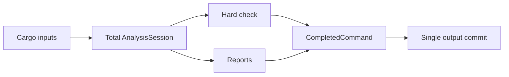
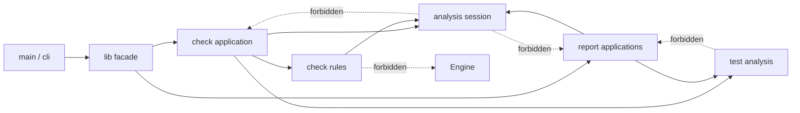

# 05 Rust Checker 能力边界收敛

## 实施结局

Marker consistency、Cargo-only check application、共享analysis facts、rules单向依赖、无状态namespace facade
删除、`test_analysis` owner和`zero-field-types` report已经落地。空字段候选采用evidence-first
策略：只报告zero-field struct + production inherent impl，derive或trait impl抑制；不新增allow
marker，不分析value usage，不影响hard check与release gate。

Proposal 04提供的callable lexical scopes、Production/Test双universe和inventory组织已经完成；已知
本地glob错误标记为external uncertainty的问题已由`TypeFactIndex`唯一owner修复，`zero-field-types`
reporter没有新增resolver。当前模块投影保持不变；刷新后的artifact和最终implementation review均无
阻塞finding，本提案可共同关闭并归档。

## 用户目标

Mode: `refactor`。Target: `code`。Compatibility: `forbidden`。

本提案要把 Rust checker 从“为通过自省规则而选择代码形状”，收敛为按真实能力和
owner 组织的实现。模块级函数如果位于精确 owning module 中，不因没有类型容器而成为
问题；类型只有在值本身承载状态、不变量、capability、trait/typestate、strategy 或稳定
API identity 时成立。无字段类型不能只作为规避 module-function owner 检查的函数口袋。

`forbidden` 表示内部 rule context、无状态 facade、未发布 report candidate 和目录形状
不保留兼容 adapter、旧 re-export、双调用路径或迁移 bridge。现有 CLI 命令、退出码
`0/1/2`、stable diagnostic codes、test inventory V1 和输出原子提交语义除非本提案明确修改，
均保持不变。

## 实施前背景与问题

提案进入实施前，checker 的稳定主轴是：



`AnalysisSession`、physical source repository、guarded module graph、subject identity 和
fatal boundary 已形成有效 owner。当时需要收敛的不是所有模块级函数，而是以下真实边界：

- `engine` 调度 rules，但 rules 反向依赖 `engine::context::RuleContext`，形成概念循环；
- module-owner marker、scope、function coverage、ancestor inheritance、usage settlement 和
  unused diagnostic 分散在 rules、engine 与 `lib.rs`；
- `lib.rs`的public check entry同时承担public facade、check application和rule-specific mutable
  state；
- `test_contract.rs` 同时因 GSS、rstest placement、wire schema、facts、fingerprint、candidate
  和 aggregate assembly 变化；
- `AnalysisSubjectResolver`、`ProjectSubjectResolver`、`FunctionUsageReport`、
  `ModuleLayoutReport`、`TestInventoryReport` 都是无字段类型，其中 report 类型只为单个
  associated function重复已有module namespace；
- `ownerless-*` marker 的 reason/redundancy 校验会被 owner 检查的早退路径跳过，使 marker
  从窄例外扩展为机械装饰；
- Proposal 04 尚未完成 projected item/call facts。Engine、function usage 和test facts仍有
  raw AST consumer，不能通过先搬目录伪装为边界已闭合。

这些问题不能通过增加一个“空类型允许 marker”解决。Marker只能证明作者写了字符串，不能
证明类型作为值被构造、传递或拥有策略；agent还可以添加假receiver、无意义`Self`返回、
`PhantomData`或dummy trait规避语法检查。

## 目标与非目标

### 目标

- Checker的目录与依赖按共享分析、check policy、test analysis、report projection和process
  boundary组织。
- Module function和type method各自由真实owner表达，不以无字段类型代替module namespace。
- Rules不反向依赖engine；module-owner规则状态机有唯一owner。
- Public facade不维护rule-specific状态。
- `ownerless-*`始终校验reason、placement、冲突与冗余；trait impl和inherent impl语义分离。
- 无字段namespace治理只产生保守report evidence；本提案不升级hard failure。
- Proposal 04和本提案各自拥有唯一范围：04拥有analysis projection与rstest semantics；05拥有
  checker organization、rule infrastructure和namespace-type治理。

### 非目标

- 不建立通用`primitives`、`utils`、`common`、`prelude`或shared service层。
- 不为当前单一consumer拆分core/CLI crates。
- 不修改`rust-module-owner-mixed-items`；module-owner继续与struct、impl、trait严格隔离。
- 不新增`namespace-type`、`capability-type`或`empty-type-role`允许marker。
- 不用目录迁移替代Proposal 04的projected item/call facts。
- 不从source AST声称识别实际内存布局意义的ZST。

## 候选方案

### 方案A：只整理文件

保持现有API与类型，只移动文件、缩短大文件。优点是风险小；缺点是保留rules到engine反向
依赖、fat `lib.rs`、module-owner多owner和raw AST语义路径。它只能改善视觉，不能证明工程
边界，拒绝。

### 方案B：按能力纵向组织

共享analysis提供total facts；check application消费analysis、rules和test analysis；reports消费
analysis/test analysis并只做投影；main/CLI拥有process副作用。类型是否存在由值语义决定，module
function继续使用精确module owner。该方向直接修复依赖和状态owner，不需要额外trait或adapter，
采用。

### 方案C：严格原语/领域/应用/adapter分层

理论依赖方向清楚，但当前checker较小，Cargo metadata、filesystem和rustc cfg外部事实与total
analysis failure有意绑定。强拆会制造ports、薄adapter和`primitives`垃圾桶，也会让`syn` AST
归属反复漂移，拒绝。

### 方案D：为空类型增加允许marker

Marker不能证明capability，当前`ownerless-method`已是反例。该方案增加placement、reason、
redundancy和组合规则，却提供最廉价的逃生口，拒绝。

### 方案E：立即禁止zero-field namespace methods

可以机械识别zero-field type上的inherent associated function，但会误报stateless algorithm API，
并可被dummy field或假Self轻易规避。当前只适合作为report candidate的输入信号，暂不作为hard
rule。

## 推荐架构

### 依赖方向



- `analysis`只拥有subject、source、cfg、module graph、session与共享projected facts。
- `check.rs`拥有跨module hard-check application和lineage/settlement生命周期驱动。
- `engine/mod.rs`拥有单module rule dispatch。
- `rules/context.rs`拥有diagnostic sink；`rules/module_owner.rs`拥有module-owner lineage与settlement
  状态语义；其他`rules/**`拥有单条hard policy。Rules不反向依赖engine。
- `test_analysis`同时服务hard check与test inventory，不归report所有。
- `report`只拥有report-specific selection、model和render。
- `main.rs`继续是唯一stdout/stderr/exit副作用owner。

### 能力拓扑与实际模块投影

```text
src/
  lib.rs
  main.rs
  cli.rs
  diagnostic.rs

  analysis/
    mod.rs
    error.rs
    subject.rs
    source_repository.rs
    cfg.rs
    module_graph.rs
    projected_items.rs
    guarded_uses.rs
    callables.rs
    type_facts.rs

  check.rs
  engine/
    mod.rs
  rules.rs
  rules/
    context.rs
    module_owner.rs
    marker_placement.rs
    impl_method_owner.rs
    impl_method_owner/signature.rs
    use_alias.rs
    test_contract.rs

  test_analysis.rs
  test_analysis/
    model.rs
    contract.rs
    issues.rs
    shape.rs
    facts.rs
    fingerprint.rs
    candidates.rs

  report.rs
  report/
    module_layout.rs
    test_inventory.rs
    zero_field_types.rs
    function_usage.rs
    function_usage/
```

早期候选曾计划把check与rules物理嵌套到`check/**`并创建独立`attributes.rs`，但实施证据表明这会把
目录形状误当成owner。当前投影保持：`check.rs`拥有跨module check application与lineage settlement
驱动；`engine/mod.rs`拥有单module dispatch；`rules.rs + rules/**`拥有hard policy、diagnostic context
和module-owner状态模型。Ordered attributes与`cfg_attr` grammar已经由`analysis::cfg`拥有，因此不创建
第二个`test_analysis/attributes.rs`。

该能力拓扑已按真实变化轴落地：`test_analysis.rs`只做aggregate orchestration，wire model、typed
issues、GSS contract、rstest shape、source facts、fingerprint和candidate分别归相邻模块；没有创建
placeholder文件、兼容re-export、空接口或第二attribute owner。稳定约束是依赖方向和唯一owner，不是
物理目录嵌套。

## 类型与函数边界

### Module function

行为没有实例identity，所有输入显式，且module已经表达精确领域owner时，使用
`module::function`。`analysis::cfg` grammar、module resolution、report renderer等局部函数不需要
无字段类型包装，也不进入通用helper容器。

### 值类型

类型至少应承担一项可审查语义：

- 保存配置、缓存、资源、生命周期或状态；
- 构造/解析后建立不变量；
- 作为值被传递、存储、借用或消费；
- 实现有行为意义的trait/strategy；
- 表达tag、typestate、capability或受保护identity；
- 作为已发布稳定API anchor，且该边界有真实consumer证据。

删除类型并把行为放回同名module后，如果不会丢失上述语义，该类型只是namespace candidate。

### Trait impl与inherent impl

- Trait impl方法由trait contract和implementing type共同拥有，不应用inherent static-helper规则。
- 一个类型实现任意trait，不能因此豁免其所有inherent associated functions。
- Inherent constructor/parser若返回或消费`Self`，属于类型。
- 无receiver且signature不携带self type的inherent function必须使用现有窄例外，或回到module
  owner；zero-field report不改变该hard语义。

### Marker一致性

`ownerless-fn`和`ownerless-method`是窄例外，不是主要组织方式：

- Marker无论item是否已有其他owner，都必须校验non-empty reason；
- 方法signature携带self type时，`ownerless-method`是冗余marker并hard fail；
- module owner覆盖的function再声明`ownerless-fn`是冲突并hard fail；
- 同一item重复或冲突owner marker hard fail；
- reason内容只验证结构、非空与既有placeholder policy，不用自然语言heuristic判断真实性。

首切片冻结以下diagnostic contract；这些是新code，不复用或改变现有code语义：

| 输入 | Diagnostic | 定位与组合语义 |
| ---- | ---------- | ------------ |
| 正确placement的`ownerless-fn`缺reason | `rust-ownerless-fn-reason` | 定位marker；reason失败后不再报告同一marker的conflict，避免一个无效声明产生两个结论。 |
| 正确placement的`ownerless-method`缺reason | `rust-ownerless-method-reason` | 定位marker；reason失败后不再报告同一marker的unnecessary/conflict。 |
| Self-bearing inherent method带合法`ownerless-method` | `rust-ownerless-method-unnecessary` | 定位marker；只报告一次，不再运行missing-owner检查。 |
| Trait impl method带合法`ownerless-method` | `rust-ownerless-method-unnecessary` | 定位marker；trait contract已提供owner，marker冗余而不是placement错误。 |
| Module-owned function带合法`ownerless-fn` | `rust-ownerless-fn-conflict` | 定位marker；module owner继续计入function coverage，不再报告function-owner-missing。 |
| 同一item重复同类ownerless marker | `rust-owner-marker-duplicate` | 定位第二个marker；每个marker仍先独立校验reason，invalid reason只报告对应reason code。 |
| 同一item同时出现不同ownerless marker | 既有placement code | 每个marker按item kind独立placement；首切片不新增跨kind conflict code。 |
| Inherent static method无Self参与且无marker | `rust-impl-method-owner-missing` | 保持既有code和method location。 |
| Trait impl method无marker | 无diagnostic | Trait contract与implementing type共同提供owner。 |

重复module-owner和unknown marker已由现有marker/parser语义处理的部分保持不变。首切片只新增
`rust-owner-marker-duplicate`对同一function或method上的重复ownerless声明；更宽的跨item marker
组合若出现真实样本，再进入后续proposal，不在本切片扩展。

## 与Proposal 04的边界

Proposal 04唯一拥有：

- ordered attribute facts；
- projected item index；
- guarded callable/import/call facts；
- engine/function usage/test inventory迁移到共享facts；
- rstest ordered placement；
- typed test issue/category和cfg budget snapshot。

本提案唯一拥有：

- check/rules依赖与state owner；
- public facade和check application边界；
- test analysis在稳定模型上的模块归属；
- 无状态namespace types删除；
- ownerless marker一致性；
- zero-field report candidate的selection、model与render；type/impl中性facts仍由Proposal 04的
  analysis projection唯一拥有。

Proposal 04投影完成后，本提案复用`ProjectedItemIndex`、`GuardedUseIndex`、`CallableIndex`和
`TypeFactIndex`；type/use/call resolver没有第二owner，也没有保留过渡snapshot或兼容入口。

## 第一个可实施纵向切片

本提案的独立代码切片已经完成：marker consistency、rules单向依赖、check application、module-owner
状态、test analysis拆分、namespace facade删除和zero-field report均已落地。当前不再驱动新的目录或
rule重构；只等待Proposal 04完成guarded type association、lexical scopes、inventory model/renderer和
最终人工治理证据。若这些切片暴露本提案owner缺口，再按implementation finding回到本提案修正。

## 实施方案

剩余关闭步骤：

1. Proposal 04完成guarded type association、lexical scopes/双universe和inventory分组。
2. 本提案复核`TypeFactIndex`结构化outcome与`zero-field-types` reporter wire聚合的owner边界。
3. 保留已经证明唯一owner的`check.rs + engine/mod.rs + rules.rs/rules/**`投影，不为匹配旧目录图迁移。
4. 回写Architecture/Experience/skill，执行full release和共同implementation review。

## Report-only candidate

`zero-field-inherent-only-candidate`不影响`check`退出码。它只覆盖production可达的unit struct、
零元素tuple struct和零字段named struct；enum、union、type alias以及任何非零字段类型不在范围内。
候选必须存在至少一个可关联production inherent impl，空impl也算；任意可关联production显式trait
impl、unsafe/negative trait evidence或direct/conditional derive均保守抑制候选。Test-only evidence
不抑制production candidate。

它至少输出：

- zero-field type identity与location；
- struct shape、visibility与inherent impl evidence；
- `value-usage-not-analyzed`、`macro-generated-impl-not-collected`与
  `external-trait-semantics-not-evaluated` warnings。

Type/impl关联、effective guard与unresolved impl target由Proposal 04的共享projected item facts拥有。
Report不得读取function-usage model、扫描裸`ModuleView::items()`或用文本末级同名匹配。普通macro、
blanket/auto trait和下游crate trait impl不可见，因此报告不能宣称类型错误、自动建议删除或证明完整
trait semantics。Candidate数量不影响release、Proposal关闭或review disposition。

Trait impl方法天然不作为namespace method；但存在trait impl不能豁免无关inherent functions。
Candidate不能输出“坏类型”或自动移动建议。合法error/tag/typestate/strategy/capability和stateless
algorithm可以成为候选；dummy trait、dummy field或`PhantomData`可规避是report-only范围内接受的漏报，
不通过hard rule或允许marker补齐。

## 验收矩阵

| 目标 | 验收 evidence |
| ---- | ------------- |
| Marker一致 | 空reason、冗余method marker、module-owner conflict和marker冲突产生精确code/location；相邻合法例通过。 |
| Trait边界 | trait impl associated function无需ownerless marker；同类型无关inherent helper仍受检查。 |
| Rule依赖单向 | source/dependency扫描中不存在`rules -> engine`；rule context归check/rules。 |
| Module-owner唯一 | marker、scope、coverage、inheritance、usage与unused settlement由单一owner编排，既有diagnostic顺序稳定。 |
| Public facade变薄 | `lib.rs`不保存rule-specific maps/pending state；公开命令语义不变。 |
| Analysis唯一 | engine/function usage/test inventory不建立第二份item/cfg/call语义。 |
| Test analysis凝聚 | GSS、shape、facts、fingerprint、candidate各有单一模块，JSON/Markdown/hard check共享aggregate。 |
| 已知namespace facades收敛 | 两个resolver与三个report unit facade删除，不要求所有report candidate清零。 |
| Candidate保守 | candidate不改变exit code，不分析value usage，能力warnings完整，结果不被自动宣称问题。 |
| Output原子 | fatal exit2无partial stdout；hard invalid exit1；report/not-applicable exit0。 |
| 文档归属 | Proposal 04/05、Architecture、Experience和rust skill无重复owner。 |

## 验证

- `cargo fmt --check --manifest-path .github/skills/rust-engineering/checker/Cargo.toml`
- `cargo check --locked --manifest-path .github/skills/rust-engineering/checker/Cargo.toml`
- `cargo test --locked --manifest-path .github/skills/rust-engineering/checker/Cargo.toml`
- `cargo clippy --locked --manifest-path .github/skills/rust-engineering/checker/Cargo.toml --all-targets -- -D warnings`
- checker self-check与test inventory人工review。
- Dependency scan：`rules`不得引用`engine`；consumer不得新增raw cfg/item/call parser。
- Namespace scan：确认已知resolver/report unit facades删除；candidate数量只作为人工review evidence。
- `deno task --cwd .github/skills/doc-validation check:docs`
- `git diff --check -- .ousia`
- `deno task check:workflow`
- `deno task test`
- `deno task smoke:install`
- `deno task release`

## 风险与回滚

- Strict module-owner隔离会继续要求module functions和types分scope；这是明确保留的约束。Review必须
  防止实现者再次用unit namespace type绕过，而不是放宽mixed-items。
- Candidate不分析value usage，也看不到macro expansion、blanket/auto/downstream trait semantics，必须保持report-only。
- 当前checker library API是否有外部consumer尚无发布证据。若实施前发现已发布契约，停止并重新决定
  compatibility，不静默增加adapter。
- Proposal 04未完成的projection/shape是后续rules/test-analysis/report重组的硬依赖。依赖未满足时
  回滚整个未发布slice，不保留双路径。

## Proposal关闭条件

以下条件全部满足后才能关闭并归档：

- 所有实施切片完成并通过相关自动验证；
- Proposal 04提供的projected item/call与rstest模型已稳定供本提案消费；
- implementation review无阻塞finding；
- Architecture已写回稳定依赖方向、owner和模块结构；
- Experience已写回marker逃逸、namespace candidate误报和review attacks；
- `zero-field-types` report contract已实现和验证；candidate数量不作为关闭条件。

## 关闭证据

- `check.rs`拥有跨module hard-check application；`engine/mod.rs`只调度单module rules；
  `rules/context.rs`和`rules/module_owner.rs`分别拥有diagnostic sink与module-owner生命周期。
- `TypeFactIndex`以guarded worklist闭合alias、named import、glob和re-export，结构化输出exact、ambiguous、
  unresolved与external-glob uncertainty；cycle通过visited frontier有界终止。
- `zero-field-types` reporter唯一拥有warning wire code、稳定排序和candidate selection；不反向承担type
  resolution，不影响`check`退出码。
- 已知无状态resolver/report facades和过渡snapshot已删除；compatibility为`forbidden`，无旧re-export、
  adapter、bridge或双调用路径。
- Proposal 04最终inventory为119个complete/valid tests、25个`rstest` templates和113个named cases；20个
  candidate groups均已人工结算，无architecture handoff。
- Checker完整Rust测试、Clippy `-D warnings`和self-check通过；已知本地glob与unknown glob回归共同
  证明exact/uncertain outcome仍由`TypeFactIndex`唯一拥有。最终implementation review仍是归档门禁。

## Proposal Review Focus

- 改动是否改善owner、依赖、状态和调用边界，而非只减少文件或增加层名。
- 精确module functions是否被错误地当作坏味道。
- Strict module-owner隔离是否在不新增允许marker时仍能防止namespace pocket复发。
- Marker consistency diagnostics是否低误报且不重复placement/owner diagnostics。
- Trait impl与inherent impl边界是否正确，dummy trait不能豁免inherent methods。
- Proposal 04与05是否各自只有一个owner，没有复制projection或rstest模型。
- `test_analysis`拆分是否等待模型闭合，而非机械拆大文件。
- Candidate是否诚实声明capability限制，未偷渡hard API style。
- 首切片是否提供可观察治理语义，而不是先横向搬目录。
