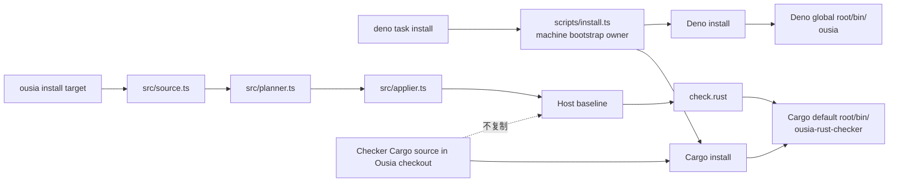
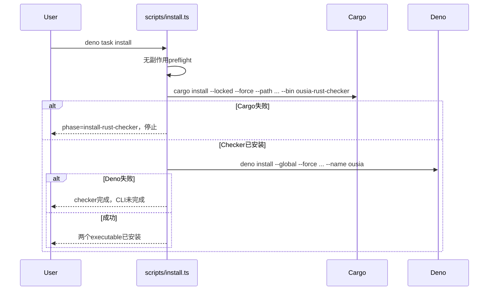
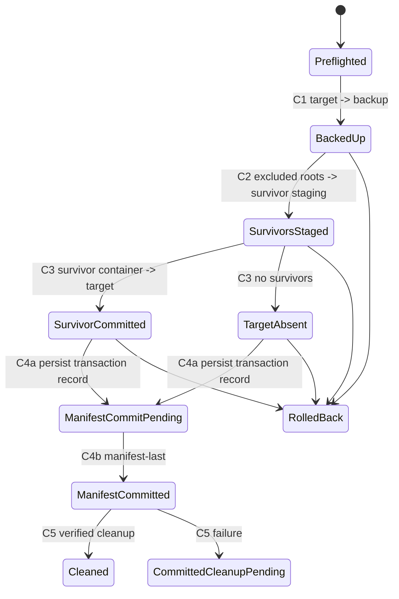

# 06 Ousia CLI 与全局 Rust Checker Bootstrap

## 状态

- Mode：`new-module`
- Target：`code`
- Compatibility：`forbidden`
- 状态：已实施、验证并通过最终implementation review；已关闭归档

实现已落地全局checker、typed build identity、checker-first bootstrap、host
runtime cutover、固定`3b7d447` predecessor authorization和C1–C5 directory
retirement。Planner handoff在applier入口冻结；sealed retirement
journals与transaction
record严格校验schema、transaction、固定路径、identity、SHA和inventory；C4按磁盘
old/new/unknown outcome结算，C5只删除逐项复验的managed entries；existing
staging读取完整persistent
authority后分类阻塞。Bootstrap已覆盖无副作用preflight、symlink
ancestor、Cargo/identity/Deno failure和诚实 partial state，runtime
preflight覆盖missing、nonzero、非法JSON、unknown schema与mismatch。

最终release route已通过Rust checker、Deno、workflow、identity、docs和真实install
smoke；最终implementation review结论为“未发现需要阻塞合入的问题。”稳定结构已写回
Architecture，Rust inventory与20组candidate disposition已刷新，未留下需要转移到新Proposal或pending的
事项。本Proposal按Compatibility=`forbidden`的既定语义关闭归档。

## 用户目标

`deno task install` 在一次本机 bootstrap 中安装或更新两个可执行程序：

1. Deno 全局命令 `ousia`。
2. Cargo 全局命令 `ousia-rust-checker`。

宿主 baseline 不再复制 `.github/skills/rust-engineering/checker/**`。Installed
validation route `check.rust` 只执行：

```text
ousia-rust-checker check-project .
```

最终实现不得保留 host `cargo run` fallback、全局 binary 与宿主 source 双
locator、旧 package/binary alias、旧 route alias、schema adapter、compatibility
facade 或双写路径。

固定选择：

- Cargo package 与 binary 名均为 `ousia-rust-checker`。
- Rust library crate 名为 `ousia_rust_checker`。
- Cargo 使用默认 install root；bootstrap 不传 `--root`。
- Host 只通过 `PATH` 定位 `ousia-rust-checker`。

## 实施前结构与问题

当前 `scripts/install-cli.ts` 只安装 `ousia`。`.ousia/framework.json` 把 checker
Cargo project 作为 `tool.rust-checker` directory asset 安装到每个宿主，host
`check.rust` 再以 `cargo run --manifest-path` 构建执行。

现有稳定 owner：

- `scripts/install-cli.ts`：本机 CLI 安装副作用。
- `.ousia/framework.json`：宿主 baseline inventory 与 validation route。
- `src/source.ts`、`src/planner.ts`、`src/applier.ts`：宿主 source、plan
  和文件事务。
- Checker Cargo crate：Rust analysis、rules、reports 和 process exit contract。

问题在于机器工具分发与宿主 baseline 生命周期混合：宿主承担 checker 源码、Cargo
resolution、现场编译、build output 和 source upgrade，但这些都不是宿主项目事实。

## 目标与非目标

目标：

1. `deno task install` 可重复安装两个 executable。
2. Checker 使用
   `cargo install --locked --force --path ... --bin ousia-rust-checker`。
3. Fresh host 不包含 checker Cargo source。
4. `check.rust` 只调用全局 binary。
5. 旧宿主中的 framework-owned checker source 通过可信 directory retirement
   删除。
6. Drift、缺少旧 membership、project overlap 或未知内容在任何副作用前阻塞。
7. 旧 asset 排除的 `target/` 等内容不被静默删除。
8. Bootstrap、host installer 和 checker runtime 各有唯一 failure owner。

非目标：

- 不发布 crates.io package或预编译binary。
- 不引入machine tool plugin/manifest框架。
- 不统一Deno和Cargo install root。
- 不伪造跨package manager原子事务。
- 不让`ousia install <target>`安装机器工具。
- 不改变checker analysis、rule、report或exit语义。

## 候选方案

### 保留宿主源码作为 fallback

先调用全局 binary，失败后退回宿主 `cargo run`。该方案形成双
locator，继续让宿主承担 Cargo project，并掩盖 bootstrap、`PATH`
和版本部署错误；与 `compatibility: forbidden` 冲突，不采纳。

### 在 Framework Manifest 中加入通用 machine tool 模型

由通用 executor 遍历 Deno、Cargo 等 package
manager。当前只有两个固定动作，且它们的 config、permission、metadata 和 failure
contract不同；通用模型会把机器生命周期混入宿主 baseline inventory，并产生空泛
adapter 和伪原子暗示，不采纳。

### 固定 machine bootstrap，加全局 checker

Cargo metadata拥有checker identity，固定bootstrap拥有两个machine
install动作，Framework Manifest只保存host assets和validation
command。该方案不增加投机扩展点，不复制源码，不需要 fallback，推荐采用。

## 推荐架构



### Machine bootstrap与build identity

`deno.json` 的 `install` task进入唯一 `scripts/install.ts`。该脚本先完成无副作用
preflight，再按固定顺序安装：

1. `ousia-rust-checker`。
2. `ousia`。

Checker必须先安装。若Cargo阶段失败，不安装新CLI；若Deno阶段失败，明确报告checker已完成、
CLI未完成，并允许幂等重试。Bootstrap不自动回滚任意旧Cargo/Deno安装，因为历史artifact与
package-manager metadata不归Ousia事务所有。



Bootstrap preflight使用与release相同的check-only identity owner重新计算canonical
digest，并要求 source manifest、artifact和当前build
inputs三者精确一致；再检查checker manifest、lockfile、Deno config和CLI
source均为checkout内普通文件且无symlink，固定命令计划没有`--root`、`cargo run`、旧
`checker`
binary或第二locator。任何不一致都先于`cargo install`失败。Preflight不运行Cargo
metadata； package/bin projection由release gate验证，实际dependency
resolution和构建失败由`cargo install`拥有。

Cargo install成功后，bootstrap必须通过唯一locator执行
`ousia-rust-checker identity --format json`。只有输出与source manifest expected
identity精确相同，
才进入Deno安装。PATH缺失、命中旧binary、非法JSON、未知schema或identity不等都归
`install-rust-checker`失败，不安装新CLI。

### Typed checker build identity

Checker manifest最终显式声明：

```toml
[package]
name = "ousia-rust-checker"

[lib]
name = "ousia_rust_checker"
path = "src/lib.rs"

[[bin]]
name = "ousia-rust-checker"
path = "src/main.rs"
```

同步更新Clap name、Rust crate path、process tests和Cargo lock root package
identity。不保留旧 `checker` target或alias。

Checker project新增source-only
`.github/skills/rust-engineering/checker/build-identity.json`：

```json
{
  "schema": "ousia.rust-checker-build.v1",
  "package": "ousia-rust-checker",
  "binary": "ousia-rust-checker",
  "sourceSha256": "<64位小写SHA-256>"
}
```

该identity只承诺当前repository build-input generation，不承诺跨平台可复现binary
bytes或安全
attestation。`sourceSha256`只消费`Cargo.toml`、`Cargo.lock`和`src/**`普通文件；按checker-relative
POSIX path 字典序排列，并以domain
separator、path长度与bytes、content长度与bytes组成canonical stream。
`build-identity.json`、`target/**`、`tests/**`、Git
revision、时间、绝对路径和机器环境不进入digest。
输入缺失、symlink、特殊文件或重复canonical path均失败。首版checker
project禁止`build.rs`、path dependency、workspace-inherited
package/dependency字段，以及checker project或repository ancestor内的
`.cargo/config`/`.cargo/config.toml`；identity generator、bootstrap
check和release gate都必须机械拒绝这些 未纳入closure的表面。用户级Cargo
config与toolchain仍归Cargo，不属于source generation承诺。

Checker使用`include_str!`嵌入artifact，并提供`identity --format json`。该命令只输出嵌入的typed
identity，不读取项目、Cargo metadata、网络或环境配置，不写文件；成功exit
0，内部schema错误exit 2且 无partial payload。它是source manifest、machine
bootstrap、installed binary和release gate之间唯一
generation协议，不同时使用package version、Git hash、binary hash或source
fallback作为第二权威。

### Host inventory与validation

`.ousia/framework.json`删除active `tool.rust-checker` directory
asset，增加最后一个已发布 checker
tree的可信tombstone，并增加窄`runtime.rustChecker`投影：

```json
{
  "runtime": {
    "rustChecker": {
      "identityArtifact": ".github/skills/rust-engineering/checker/build-identity.json",
      "buildIdentity": {
        "schema": "ousia.rust-checker-build.v1",
        "package": "ousia-rust-checker",
        "binary": "ousia-rust-checker",
        "sourceSha256": "<与artifact相同>"
      }
    }
  }
}
```

该对象只表达当前唯一Rust checker runtime
contract，不扩展为`tools[]`、provider、plugin、launcher或 machine
package-manager DSL。`check.rust`改为：

```json
{
  "id": "check.rust",
  "command": ["ousia-rust-checker", "check-project", "."],
  "cwd": "."
}
```

Manifest不保存Cargo root、machine
install状态、fallback或package-manager命令DSL。

当前source
manifest将`schemaVersion`精确升级为`1.1.0`；`runtime.rustChecker`在1.1
source中必填且 unknown-field校验保持严格。`readSourceSnapshot`只使用1.1
loader，并把已验证projection直接保存为
`SourceSnapshot.runtimeRustChecker`；runtime
preflight只消费该typed值，不二次读取manifest或建立第二 identity authority。

旧target retirement evidence不复用1.1 source loader。`planner.ts`内相邻的私有
`readPredecessorManifestEvidence`只接受精确`schemaVersion: "1.0.0"`、workflow
ID和3b7d447 cohort所需的 active asset
membership字段；它不返回完整FrameworkManifest，不接受其他旧version，不归一化缺失字段，
也不提供通用旧schema API。该窄projection仅证明一次retirement
ownership；所有新source、route和runtime 仍只有1.1语义，因此不构成compatibility
adapter。

Source-backed `ousia`在读取并验证source snapshot后、读取target
manifest和进入planner前，固定通过
PATH调用`ousia-rust-checker identity --format json`并比较expected
identity。Missing、非零、非法输出 或mismatch分别产生typed runtime preflight
error；不得进入planner、创建staging或自动修复机器状态。 Installed
`ousia`只获得`--allow-run=ousia-rust-checker`，不得获得`cargo`、`deno`或shell。Machine
bootstrap需要执行Cargo、installed
checker与`Deno.execPath()`，作为显式高信任安装入口保留task级
`--allow-run`；该权限不进入installed CLI。Runtime permission denied映射为
`rust-checker-runtime-missing`，并证明host target未改变。

Repository提供显式写入`generate:rust-checker-identity`和check-only
`check:rust-checker-identity`。Release重算canonical
digest，比较artifact与manifest projection，构建并 执行binary
identity，再验证最终package/lib/bin名称。Release可以用隔离、offline、no-deps
Cargo metadata 验证projection；runtime
preflight不运行metadata，也不回退到手写TOML猜测。

唯一identity计算owner落在Deno模块`scripts/rust-checker-identity.ts`。它公开窄API：
`calculateRustCheckerIdentity(root)`负责closure validation与canonical stream；
`checkRustCheckerIdentity(root)`只比较计算值、artifact和typed manifest
projection；
`writeRustCheckerIdentity(root)`是唯一写入入口。`scripts/generate-rust-checker-identity.ts`与
`scripts/check-rust-checker-identity.ts`只调用该API，`scripts/install.ts`直接调用check-only
API，不启动 第二task/process。该owner使用单一TOML parser读取完整Cargo
manifest，机械拒绝build script、所有path dependency、workspace
inheritance和禁止的local Cargo config。Rust crate只解析/嵌入artifact并提供
identity命令，不重算source digest。

### 支持的升级generation

本次只直接支持前一发布generation
`3b7d44754189709f41f17e278f1789b486b0bff3`产生的active directory
membership：ID为
`tool.rust-checker`，target为`.github/skills/rust-engineering/checker`，ownership为framework，
shape为directory，update/retire为replace/delete，exclude为`["target"]`。Release从冻结Git
object重建 唯一managed tree
digest并写入Proposal关闭证据；revision只作为生成provenance，host
planner不读取Git。

Directory tombstone wire固定扩展当前`RetiredAsset`为封闭file/directory
union。现有file形状继续是 `{id,target,sha256}`；directory形状必须显式为
`{id,target,shape:"directory",exclude:["target"],treeSha256:"<managed tree digest>",previousManifestSha256:"<predecessor manifest digest>"}`。Validator要求
directory
tombstone的shape/exclude与旧membership逐字段相同；不接受digest数组、revision字段、缺省shape
猜测或第二schema resolver。

更旧逐文件generation确定性产生`unsupported-rust-checker-upgrade-generation`并阻塞。Remediation是先
checkout `3b7d447`，运行其release、install和`ousia install`把宿主转换为directory
generation，再返回 当前checkout完成bootstrap和host
upgrade。该人工两跳不在当前实现中建立adapter、转换、双写或fallback。

### 可信directory retirement状态机

Retirement authority必须同时具备：

- 当前source tombstone。
- 旧target manifest中的同ID framework membership。
- 精确相同target。
- 旧membership的`shape: directory`和`exclude`。
- 目标受管tree digest等于tombstone digest。

Planner从旧membership派生shape和exclude；tombstone不能扩大旧ownership。Plan携带accepted
generation、managed tree digest、canonical non-overlapping exclude roots、target
precondition及每个现存
survivor的identity/digest。Digest、shape、symlink、special file、unknown
child、project overlap或generation 不符时，在staging前阻塞。

`PlanItem`收敛为封闭discriminated
union；现有create/replace/delete/conflict等variant保留各自必填字段， directory
retirement使用独立`action: "retire-directory"` variant。该variant必须携带asset
ID、target、 accepted predecessor marker、managed digest、canonical exclude
roots、target precondition和survivor
preconditions；这些字段只由planner的predecessor evidence与target
read产生，generic delete不能构造。

`applyInstallPlan`是transaction-wide状态推进owner。Directory
retirement使用独立typed persistent journal， 不复用普通file delete或generic
cleanup。Journal以sealed JSON保存在transaction staging内固定路径，包含
schema、transaction sentinel identity/content、target、backup、managed
digest、survivor locations和state；
每次rename后先写新journal临时文件并原子替换，再进入下一mutation。Generic
cleanup不得删除 directory-retirement backup或journal。多个retirement
journal不各自拥有C4；staging中另有唯一sealed transaction commit
record，保存旧/新manifest digest与identity、全部retirement journal IDs和
`ManifestCommitPending|ManifestCommitted|CommittedCleanupPending`状态。C4前rollback只由各retirement
journal拥有，transaction commit record尚不存在。状态固定为：



Journal保存original/backup/survivor-container identity、managed
digest，以及每个survivor的relative path、
identity、digest和`Backup|SurvivorStaging|CommittedTarget`
location；state与location都用封闭enum match。

- C1紧前复验target identity与managed digest，再原子rename到transaction backup。
- C2在staging内创建有identity guard的survivor container，按canonical
  path逐个rename excluded root， 每次成功立即提交journal location。
- C3有survivor时原子提交整个container回原target；无survivor时target保持不存在。
- C4a所有host mutation完成后，先原子持久化transaction-wide
  `ManifestCommitPending`，记录旧manifest identity/digest、staged新manifest
  identity/digest和全部retirement journals；此前任意失败必须回滚。
- C4b复验pending record与staged
  manifest后最后提交新manifest，再原子推进transaction record到
  `ManifestCommitted`；retirement journals不逐个承担C4权威。
- C5 cleanup前复验committed survivor、backup与managed
  digest；只删除已证明不含survivor identity的backup。

Rollback按journal逆序：已提交target先移回survivor
staging，再把每个survivor按location移回backup，最后
backup原子恢复target。Identity、digest或location不匹配时进入recovery-required并保留现场，不继续猜测或
清理。Survivor不移动到transaction staging之外。没有excluded
child时整个目录退休；存在`target/`时只 保留该unmanaged survivor tree。

C4恢复只消费transaction-wide
record与磁盘manifest：pending时若目标仍精确等于旧manifest，允许按
pre-C4路径rollback；若目标已精确等于新manifest，必须先把record结算为`ManifestCommitted`并进入
post-C4路径；若两者都不等，只报告recovery-required并保留现场。由此即使manifest
rename成功而record 更新失败，也不会根据pre-C4 retirement journal错误恢复旧tree。

C4提交后不得回滚到旧generation。C5复验或cleanup失败进入`CommittedCleanupPending`：新manifest与
committed survivor保持有效，剩余backup/staging由该transaction
identity拥有但不得继续猜测删除；命令返回
`apply-recovery-required`并报告可核对的target、backup、guard与managed
digest。下一次install检测到该现场 时由sealed
journal区分pre-C4与`CommittedCleanupPending`并阻塞，要求人工按diagnostic核验后清理。
Manifest commit由`applyInstallPlan`和唯一transaction commit
record拥有，而不是仅依赖item排序。首版不
承诺进程崩溃后的自动恢复；进程内每个rename与journal原子提交之间的异常必须由相邻操作立即结算，无法
证明identity时保留现场。C4后任何错误只能进入`CommittedCleanupPending`，不得进入rollback分支。

## Owner与不变量

| Concern               | 唯一owner                                   | 状态或输出                       |
| --------------------- | ------------------------------------------- | -------------------------------- |
| Bootstrap entry       | `deno.json` install task                    | 进入唯一bootstrap                |
| Machine orchestration | `scripts/install.ts`                        | phase-aware install result       |
| Checker identity      | identity artifact与generator                | canonical build generation       |
| Cargo install root    | Cargo config                                | Cargo metadata与binary           |
| Runtime expectation   | `.ousia/framework.json.runtime.rustChecker` | expected identity与artifact path |
| Host inventory        | `.ousia/framework.json`                     | baseline membership与route       |
| Host plan             | `src/planner.ts`                            | 无副作用`InstallPlan`            |
| Host mutation         | `src/applier.ts`                            | target tree与rollback            |
| Host Rust resolution  | Checker `check-project`                     | checked/not-applicable/fatal     |

最终必须成立：

1. Host checker locator只有`ousia-rust-checker`。
2. Checker source只存在于Ousia checkout，不进入fresh host。
3. Bootstrap Cargo命令不含`--root`。
4. `check.rust`不含`cargo`、`Cargo.toml`或checker source path。
5. Repository self-check可以继续从Cargo source运行，但不进入host route。
6. Retirement conflict全部先于宿主副作用。
7. Excluded children在成功和rollback中都不丢失。
8. 不声明跨Deno/Cargo原子性，不保留兼容双路径。
9. `ousia install`在host planning和mutation前证明PATH binary与source expected
   identity一致。
10. 只有声明的前一directory generation可直接retire；更旧generation确定性阻塞。

## 实施切片

### 切片一：Build identity、Machine bootstrap与最终binary identity

建立canonical identity generator/artifact/embedded CLI，修改checker
package/lib/bin名称，建立
`scripts/install.ts`，让`deno task install`先Cargo、验证installed
identity、再Deno安装。以隔离
`CARGO_INSTALL_ROOT`和`DENO_INSTALL_ROOT`连续执行两次；覆盖preflight、Cargo
failure、post-install identity mismatch和Deno
failure。所有preflight失败必须证明两个machine roots与已有executables逐字不变；
Cargo失败不得调用Deno。Deno调用前失败必须证明旧`ousia` bytes不变；一旦进入真实
`deno install --global --force`，其wrapper
replacement状态归Deno，失败时bootstrap保留stderr并报告CLI
状态未知，不承诺上游未提供的逐字rollback，用户修复条件后幂等重跑。

该切片不单独发布，也不保留旧host路径作为过渡。

### 切片二：Host cutover与directory retirement

删除active checker asset，添加基于最后发布tree
digest的tombstone，扩展planner/applier支持从旧 membership派生的可信directory
retirement，将`check.rust`切换为全局binary，并在installer进入planner前
建立runtime identity preflight。覆盖fresh、声明cohort
upgrade、更旧generation阻塞、drift、missing membership、project
overlap、每个retirement commit point、excluded child和rollback。

### 切片三：文档与发布闭环

更新`README.md`、`rust-engineering`
skill和Architecture：明确`deno task install`安装两个工具； Cargo与Deno
bin目录都需在`PATH`；`ousia install`只管理宿主baseline；repository
self-check和host validation是两条不同边界。运行完整validation、implementation
review并归档本Proposal。

## 验收矩阵

| 目标状态                           | Evidence                                                     |
| ---------------------------------- | ------------------------------------------------------------ |
| 最终Cargo identity                 | Cargo metadata、CLI/process tests                            |
| Source/binary generation一致       | generator check、embedded identity、runtime preflight tests  |
| 一次安装两个工具                   | 隔离machine-install smoke                                    |
| Bootstrap可重入                    | 连续两次安装成功                                             |
| Checker-first顺序                  | command-order与failure-injection tests                       |
| Preflight失败无副作用              | machine roots与旧executables逐字不变                         |
| Cargo失败停止CLI                   | Deno command未启动，旧CLI不变                                |
| Deno失败诚实部分完成               | 调用前失败旧CLI不变；调用后失败状态明确为unknown并可幂等重试 |
| Cargo默认root                      | 参数中不存在`--root`                                         |
| Fresh host无checker source         | installer integration与tree scan                             |
| Host route直连binary               | manifest contract test                                       |
| Identity mismatch阻断host mutation | planner未进入、staging不存在、target bytes不变               |
| 可信directory retirement           | matching/drift/membership tests                              |
| 旧generation边界                   | 声明cohort成功、逐文件generation确定性阻塞与remediation      |
| Excluded output保留                | C1-C5逐提交点fault injection、success与rollback tests        |
| Global checker检查宿主             | installed executable smoke，覆盖exit 0/1/2                   |
| 无fallback或旧alias                | repository结构扫描                                           |
| 文档与workflow闭合                 | docs checker、workflow checker                               |
| 发布闭合                           | `deno task release`和implementation review                   |

所有新增Rust
tests继续使用强制GSS；测试必须穿过真实process、planner、applier或bootstrap边界，证明
失败无副作用，不复述内部match表。

## 兼容、失败与回滚

Compatibility为`forbidden`：新host不执行旧Cargo
source，新checker不安装旧binary/package alias，
不保留旧route、fallback、双写或schema adapter。Directory retirement是旧framework
membership授权的 一次删除，不是兼容facade；证据不足时保留目标并阻塞。

跨package
manager安装非原子。恢复路径是修复前置条件后重跑`deno task install`，而不是bootstrap
自行猜测并恢复旧版本。

失败状态合同：任一bootstrap preflight失败时Cargo/Deno install
roots和已有executables逐字不变；Cargo
install失败时不启动Deno且旧CLI不变；post-install identity mismatch仍归Cargo
phase并停止。Deno命令
调用前失败时旧CLI不变；调用后的失败只报告`phase=install-cli`、checker已完成与CLI状态未知，不伪造
rollback保证。Smoke的PATH只能命中隔离Cargo root，不能意外调用开发机checker。Host
cutover与machine bootstrap只在同一最终release中交付，不允许形成可发布中间态。

若host
baseline已切换后需要Git回滚：先回退checkout并重新运行旧release与install，再对宿主执行旧
`ousia install`恢复旧route，最后按需`cargo uninstall ousia-rust-checker`。不得先卸载global
checker， 制造host route不可运行窗口。

## 文档归属

- Proposal 06保存候选、迁移、失败顺序、切片、验收和关闭证据。
- Architecture在实施通过后保存machine bootstrap、host installer、checker
  runtime和directory retirement的稳定owner。
- `rust-engineering` skill保存installed checker调用合同与repository
  self-check边界。
- README保存安装入口、PATH要求和更新顺序。
- 本次不预设Experience改动；只有review发现可复用失败模式时再写入。

## 验证

实施后至少运行：

- Checker
  `cargo fmt --check`、`cargo check --locked`、`cargo test --locked`、Clippy
  `-D warnings`和self-check。
- `deno task check`、`deno task test`、`deno task check:workflow`。
- `deno task --cwd .github/skills/doc-validation check:docs`。
- `deno task smoke:install`和`deno task release`。
- `git diff --check -- .ousia`。
- 结构扫描证明host manifest没有`cargo run`，fresh host没有checker
  source，仓库没有旧alias或第二 locator，bootstrap Cargo参数没有`--root`。

## Assumptions与风险

- 机器已有Cargo/Rust工具链，Cargo默认install root的`bin`已进入运行环境`PATH`。
- 同一机器所有宿主共享一个checker binary；每次host install通过typed build
  identity证明它与当前source generation一致。
- `cargo install --locked`可能需要网络获取未缓存依赖；失败由Cargo拥有并停止bootstrap。
- 最后一次发布checker tree digest必须从Git准确重建，不能使用改名后的tree。
- 旧host有drift时升级有意阻塞，用户需恢复旧bytes或人工移走冲突内容。
- Retirement可留下只含excluded `target/`的目录壳；这不等于checker
  source仍被安装。

## Proposal Review Focus

- 固定bootstrap是否比machine-tool framework更符合当前真实变化轴。
- Checker-first顺序和partial failure是否诚实。
- Cargo默认root是否被重新推导或双重定位。
- Tombstone digest是否来自最后已发布旧tree。
- Directory retirement是否严格从旧membership派生shape/exclude。
- Excluded children是否可能在success、rollback或cleanup中丢失。
- Fresh、upgrade、drift和rollback测试是否穿过真实边界。
- `check.rust`、README、skill和smoke是否残留host Cargo fallback。
- Package/binary改名是否完整且没有旧alias。
- Identity digest是否只由唯一generator拥有，runtime mismatch是否严格先于host
  planning。
- 旧逐文件generation是否确定性阻塞而没有隐藏adapter。
- C1-C5任一失败是否都能按journal恢复，cleanup是否可能删除survivor。
- Installed CLI是否仅获得checker
  allow-run，Deno调用后失败是否诚实保留unknown状态。

## 关闭条件

当前Rust inventory在revision
`3b7d44754189709f41f17e278f1789b486b0bff3`叠加本Proposal完整 worktree
diff上刷新，生成入口为checker的`report test-inventory --format json|markdown`，artifact保存在被
Git忽略的`target/review-artifacts/proposal-06/`：

- JSON
  SHA-256：`a230f6316205c97d25ba51a98783de9d897759f0000c0224c415690acd6c906c`
- Markdown
  SHA-256：`f9bc48ab850aa5bbe355c75588671f25f2e6f8602152b78b176ef9570c83a614`
- `rustc_cfg_sha256`：`447034d49f786d000ef517d335d158940bbd551fe7fee61ce389f9998d64092a`
- Summary：120 tests，120 complete contracts，0 invalid contracts，120 valid
  shapes，0 invalid shapes， 95 plain tests，25 `rstest` templates，114 declared
  cases。

当前20个candidate stable keys与Proposal
04最后一轮一致：10个`multi-contract-test`和10个
`parameter-matrix-candidate`。已按新artifact中的完整test
IDs逐组复核；所有组继续“保留”，理由仍分别是
输入/输出载体不是第二契约，或候选成员保护不同owner、region、guard
correlation、resolution、identity、
exclusion或成功/失败不变量。新增`identity_process_emits_typed_build_identity`未进入candidate
group；无需删除、 拆分、矩阵化或architecture
handoff。该disposition只绑定上述artifact；Rust test source或inventory模型再次
变化时必须重新生成并复核。

只有以下条件全部成立才归档：

1. 最终Cargo package/lib/bin identity和canonical build identity落地。
2. 隔离环境连续两次安装两个executable。
3. Bootstrap preflight、Cargo failure、identity
   mismatch及Deno调用前/后failure状态测试通过。
4. Runtime identity mismatch在planner/staging前阻断host mutation。
5. Fresh host不含checker source，host route只运行global binary。
6. 声明前一cohort可信retirement，更旧generation确定性阻塞且remediation有效。
7. Directory retirement C1-C5、matching、drift、membership、project
   overlap、excluded child和rollback测试通过。
8. Repository不存在fallback、双locator、旧alias或machine-tool manifest。
9. README、Rust skill和Architecture写回稳定事实。
10. Identity check、Cargo、Deno、docs、workflow、smoke和release全部通过。
11. Proposal review与implementation review均无阻塞finding。
12. 未完成事项进入新Proposal或pending，没有随归档丢失。
