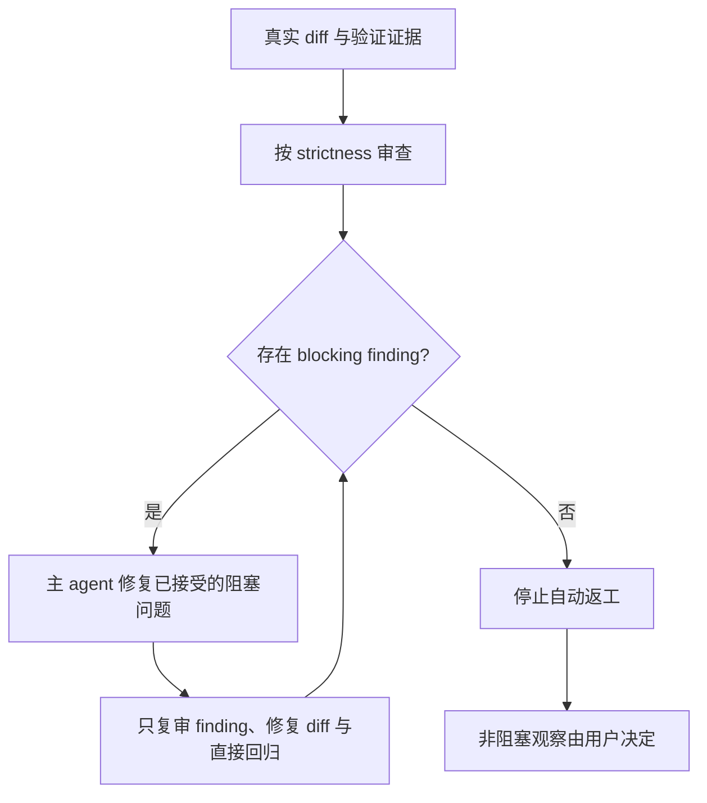

# 07 有界 Review 与可配置 Reviewer

## 状态

- Mode：`refactor`
- Target：`product`
- Compatibility：`required`
- 状态：已实施、验证并通过 focused implementation review；已关闭归档

稳定的 materiality、strictness、blocking disposition、用户 opt-in 与复审 stop
condition 已落入 `black-team-review`；所有安装宿主通过 baseline workflow instruction
调用用户级 `Ousia Reviewer`，self-host policy补充配置和失败边界。用户 reviewer 已在
`~/.copilot/agents/ousia-reviewer.agent.md` 使用精确模型标识配置，并通过真实 diff
读取冒烟。文档、workflow、90个Deno tests和完整release均通过；最终focused复审结论为“未发现需要阻塞合入的问题。”

## 用户目标

保留 review 对 correctness、security、compatibility 和用户目标偏移的阻断能力，避免模型能力提升后把所有启发式改进升级为漫长返工。同时 reviewer 不再必须使用主 agent 同名模型，个人可以持久选择 review 模型。

## 当前问题

`black-team-review` 已定义 `critical`、`high`、`medium` 和 `low`，但没有明确哪些 finding 阻塞、谁决定处理非阻塞问题、复审可以扩大到什么范围，以及何时必须停止。主 agent 因而可能持续修复新出现的 `medium`/`low`，即使实现已经满足用户目标和发布门禁。

仓库 self-host policy 还要求 subagent 默认显式传入主 agent 同名模型。VS Code 的模型选择优先级是调用时显式 model、custom agent frontmatter model、主会话 model；因此当前策略会覆盖用户 custom reviewer 的持久配置。该调用规则必须同时进入 baseline `ousia-workflow.instructions.md`，否则只会改善本仓库，安装后的宿主项目没有 reviewer model 路径。

## 目标与非目标

目标：

1. 默认 focused review 只让 `critical`/`high` 自动阻塞。
2. `medium`/`low` 去重汇总，由用户决定是否进入当前工作。
3. 复审只验证已接受的阻塞 finding、修复 diff 和直接回归；仍有阻塞问题时继续，没有阻塞问题时停止。
4. Review finding 必须证明 material impact，不能仅凭存在更优实现、更多测试组合或文案偏好阻塞。
5. Review 使用用户级 `Ousia Reviewer` custom agent，其 frontmatter `model` 是个人配置权威。
6. 配置缺失时停止并报告；custom agent 或 model 精确标识错误时，只按工具返回的可用列表修正一次，不无证据换模型。

非目标：

- 不降低 tests、checker、release 或安全 gate。
- 不按固定轮数忽略残留 `critical`/`high`。
- 不在 Framework Manifest 或项目 facts 保存 provider/model。
- 不建立模型 API、凭证、benchmark 或第二套配置中心。
- 不要求团队共享个人 reviewer 模型。

## 候选方案

### 只更换较温和的模型

模型行为会继续演进，不能定义什么可以驱动返工，也无法保证真实高风险问题继续阻塞，不采纳。

### 在 Framework Manifest 或项目 facts 增加 model 与 max rounds

模型可用性属于用户/editor runtime，不是静态 route 或项目事实。固定轮数还可能放过残留 high，或强迫无意义复审，不采纳。

### 仓库固定 reviewer agent 与模型

团队成员的 provider、配额和可用模型可能不同；把个人偏好提交到 baseline 会制造不可移植配置，不作为默认方案。

### 有界 review 合同与用户级 custom reviewer

`black-team-review` 继续拥有 materiality、severity、blocking、输出和 stop condition；用户级 `~/.copilot/agents/ousia-reviewer.agent.md` 只拥有执行模型与只读取证工具。Review 调用不再显式覆盖 model。该方案保持唯一 owner，并使用 VS Code 原生 custom agent 能力，采用。

## 目标模型

Review 强度：

- `focused`：默认；只有 `critical`/`high` 阻塞。
- `balanced`：当前纵向切片内、证据充分且局部可修的 `medium` 可以阻塞。
- `exhaustive`：用户明确要求深审时完整展示所有级别，但仍必须证明 material impact。

复审状态：

模型配置边界：

- 用户级 `Ousia Reviewer` custom agent 的 `model` 是持久配置入口。
- 正常 review 调用不得传 tool-level model。
- 用户当次明确指定 model 时，允许一次性 override。
- Agent 缺失或 model 未配置时停止 review。
- Custom agent/model 名称错误且工具返回可用列表时，按该证据修正一次；网络、拒绝、额度或其他外部失败停止，不降级或循环重试。

## 首个实施切片

修改 `black-team-review`、baseline workflow instruction 和 self-host policy，建立默认 focused、materiality、阻塞阈值、用户 opt-in、复审 scope 与 stop condition；所有安装宿主的 review 都路由到用户级只读 `Ousia Reviewer`。不修改 manifest schema、route discriminator、project facts 和 deterministic validation。

## 实施步骤

1. 将用户纠偏和 VS Code model precedence 写入 Experience。
2. 在 `black-team-review` 中定义 strictness、materiality、blocking disposition、复审范围和终止信号。
3. 在 baseline workflow instruction 中声明宿主 review 的执行载体，在 self-host policy 中补充本仓库失败处理；两者都把 review 路由到用户级 `Ousia Reviewer`，但不复制 review 语义正文。
4. 创建用户级 custom agent，要求显式 model 配置；不复制 review 规则正文。
5. 用 focused 无阻塞、focused 有 high、exhaustive 三个场景评测。
6. 运行 docs、workflow、release 和 implementation review。

## 验收矩阵

| 目标 | Evidence |
| ---- | -------- |
| 正确实现不因偏好返工 | focused 场景只有 non-blocking follow-ups，并立即停止 |
| High 继续阻塞 | 注入真实 correctness finding，修复前阻塞、修复后复审停止 |
| 用户可要求深审 | exhaustive 场景完整展示但明确 blocking disposition |
| 模型个人可配置 | `Ousia Reviewer` frontmatter 使用精确 model，调用不覆盖 |
| 配置与名称失败可诊断 | 缺失 agent/model 时停止；精确标识错误只按工具可用列表修正一次 |
| Static route 不漂移 | Manifest route 与 project facts 无 model 字段 |
| 发布无回归 | docs、workflow、release 全部通过 |

## 迁移、回滚与风险

现有 review subject、mode、scope、证据与输出主体保持。默认 severity disposition 收窄为 focused；用户可以显式选择 balanced 或 exhaustive。VS Code 内部对成本层级或 provider 的选择仍归 editor runtime，Ousia 只承诺精确调用标识和工具可见错误处理，不伪造实际模型验证。回滚时可恢复旧 skill、baseline/self-host policy，并删除用户 custom agent，不涉及代码或数据迁移。

剩余风险是不同模型对 severity 的判断仍可能不同；materiality evidence、用户 opt-in 和复审 scope 用于限制该差异的成本，而不是伪造完全确定的模型行为。

## Review Focus

- 是否错误削弱了 correctness/security/compatibility gate。
- 是否把 model 偏好写入 framework/project事实。
- 是否所有安装宿主都能从 baseline route 到 custom reviewer。
- 是否仍有父 agent 无条件显式 model 覆盖 custom reviewer。
- 是否允许 non-blocking finding 自动延长返工。
- 是否用固定轮数替代 blocking stop condition。

## 关闭条件

实施、验证和 focused implementation review 无 `critical`/`high`；稳定 owner 写回 Architecture；可复用纠偏保留在 Experience；未完成事项有明确 owner。满足后移动到 archive，保持编号不变。