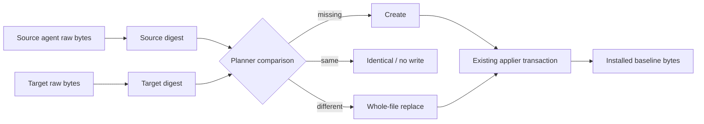

# 09 安装并整体更新 Reviewer Agent

## 状态

- Mode：`refactor`
- Target：`code`
- Compatibility：`forbidden`
- 状态：已实施并关闭

## 关闭结论

Reviewer 已作为 `tool.ousia-reviewer` 普通 framework file 进入安装 inventory；fresh、任意 target 漂移、copied-source update 和幂等 no-write 均有真实 installer 或 installed CLI evidence。Runtime 保持无 agent 特例，稳定 owner 已写回 Architecture，纠偏 evidence 已写回 Experience。

`deno task release` 在清理携带旧 checkout 绝对路径的 Cargo target cache 后完整通过；focused implementation review 输出“未发现需要阻塞合入的问题”，并判定本提案可关闭归档。

## 用户目标

`ousia install` 必须为目标项目安装 `.github/agents/ousia-reviewer.agent.md`，确保 baseline workflow 要求的 review 执行载体真实存在。每次 install 或 update 都以 Ousia source 中的完整文件为唯一 desired state；用户通过安装计划和 Git 变更决定接受、调整或回退 baseline。

本提案修正 Proposal 08 将 Reviewer 定义为 host-owned、clone-local、installer 不接管的结论，也停止采用本提案早期的 model-only mixed ownership 方向。Proposal 08 保留为历史决策证据，不再作为当前架构权威。

## 当前边界

Baseline instruction 已要求调用项目级 `Ousia Reviewer`，但当前 agent 被 `.git/info/exclude` 忽略，未进入 Framework Manifest，也不会随 install 分发。Fresh host 因此得到调用协议，却缺少执行载体。

Installer 已支持普通 framework file 的完整生命周期：source snapshot 保存原始 bytes 和 digest；planner 在目标缺失时产生 `create`、digest 一致时产生 `identical`、目标漂移时产生 `replace`；applier 在副作用前复验 source 与 target evidence，把完整 source bytes 写入 staging，并通过 backup、rollback 和 manifest-last 提交。该链路不解析文件内部字段，也不需要 agent 专用 runtime。

## 目标与非目标

目标：

1. Fresh install 安装可启动的项目级 `Ousia Reviewer`。
2. Reinstall/update 将 agent 的任意漂移整体恢复到当前 source baseline。
3. 目标已经与 source 完全一致时保持 `identical`，不做无意义物理写入。
4. 复用现有 source、planner 和 applier 边界，不新增 agent 特例。
5. 保持 target precondition、rollback、manifest-last、review 语义 owner 和 no user-level fallback 不变量。
6. 用户使用 dry-run 和 Git status/diff/stage/commit 接受、调整或回退安装结果。

非目标：

- 不保留 installed agent 的 `model` 或任何其他字段。
- 不实现 YAML parse、field merge、managed region、sidecar 或三方合并。
- 不新增 `agent` kind、Manifest generation、旧 schema adapter 或 agent registry。
- 不机械校验模型运行时可用性，也不建立模型 API 或凭证管理。
- 不修改 `black-team-review` 的 severity、blocking、输出或 stop condition。
- 不要求内容已一致时仍改写 inode 或 mtime。

## 候选方案

### 方案 A：普通 opaque tool file replace（采用）

在 Framework Manifest 中将 Reviewer 声明为 framework-owned `tool` file，复用现有 replace/delete 生命周期。`tool` 在当前 schema 中表示不进入 prompt route、由 framework 整体管理的 opaque support asset；installer 只比较和提交完整 bytes。

该方案没有新的运行时变化轴。Agent source、普通 file planner 和 applier 事务边界已经足以表达用户目标。

### 方案 B：新增 opaque agent kind

新增 `agent` kind 仍然执行相同的 whole-file replace，却会扩展严格 enum、触发 schema generation 与 predecessor 兼容设计，并增加未来 retirement 成本。没有独立生命周期、route 或机械校验语义支撑这项抽象，不采用。

### 方案 C：typed agent 与 model-only materialization

解析 target frontmatter、保留 `model` 并重建 desired bytes，需要 agent codec、serializer、prepared payload handoff、额外 diagnostics 和失败矩阵。它违背“不保留任何 target 字段”的新目标，也让单文件 baseline 获得不必要的 mixed ownership，不采用。

### 方案 D：继续 host-owned

Host-owned 文件允许每个 checkout 自行配置，但 fresh install 无法保证执行载体存在，baseline workflow 仍不可完整执行，不采用。

## 推荐设计

### Owner

- `.ousia/framework.json`：Reviewer membership、canonical source/target、framework ownership 和 replace/delete 生命周期。
- `.github/agents/ousia-reviewer.agent.md`：完整 baseline bytes、执行角色与工具边界；不拥有 review workflow。
- `src/source.ts`：现有 raw source bytes 与 digest owner，不新增 agent 分支。
- `src/planner.ts`：现有 file create/identical/replace 与 target precondition owner，不解析 frontmatter。
- `src/applier.ts`：现有 source identity、staging、backup、rollback 和 manifest-last 副作用 owner。
- `.github/skills/black-team-review/SKILL.md`：review 语义和输出合同的唯一 owner。
- VS Code：agent discovery、frontmatter interpretation 和 model runtime availability。
- Git：安装成功后的接受、调整和回退 owner。

### Manifest 与 route

新增 `tool.ousia-reviewer` file asset：source/target 均为 `.github/agents/ousia-reviewer.agent.md`，framework-owned，`update: replace`，`retire: delete`。保持 schema `1.1.0`，不声明 `native`，不增加 predecessor decoder。

Reviewer 不进入任何 task/concern route 的 `read` closure，也不占 prompt budget。`.github/agents/**` 只通过 path concern 路由到 prompt-surface 与 documentation 维护能力；现有 `.github/**` 文档 validation trigger 已覆盖该路径。

### 数据流与失败顺序

所有 source validation、target evidence 和 plan 决策均先于 staging。Applier 在 staging 前和 mutation 紧前执行现有复验；失败时沿用通用 rollback。Manifest 继续是最后一个 mutable item。Agent 不增加解析、默认值、错误映射或副作用 owner。

## 最终目标状态

- Reviewer source 由 Git 跟踪并进入 Framework Manifest，不再依赖 clone-local exclude。
- Fresh install 写入完整 agent baseline。
- Target agent 任意字节漂移后，reinstall/update 产生 whole-file replace。
- Source baseline 变化后，update 写入新的完整 source bytes。
- 内容一致时计划为 `identical` 且不写入。
- Reviewer 不进入 prompt route closure；`black-team-review` 仍唯一拥有 review workflow。
- Runtime source、planner、applier 和 installer 不出现 agent 路径特判、codec 或 merge。
- 用户从安装 dry-run 与 Git 变更决定接受、调整或回退。

## 首个可实施纵向切片

输入是 source Manifest、source agent raw bytes、目标 Manifest 和可选 target agent bytes；输出是安装后的项目级 Reviewer，其完整内容等于当前 source baseline。切片跨越 Manifest inventory、source snapshot、普通 file planning、applier 事务、installed CLI 和 VS Code discovery，但不新增 runtime API。

完成条件：

- Agent source 可被 Git 跟踪并作为 `tool.ousia-reviewer` 进入 source snapshot。
- Fresh install、target drift reinstall 和 copied-source update 都得到 source exact bytes。
- 重复 install/update 不再写 agent。
- Route closure 不加载 agent。
- 通用 target precondition、rollback 和 manifest-last evidence 继续成立。
- Prompt surface、README、Architecture 和 Experience 同步。
- Tests、installed smoke、文档检查、workflow 检查和 focused implementation review 通过。

## 实施步骤

1. 从 local exclude 移除 Reviewer 路径，将 agent 作为 tracked source。
2. 在 Framework Manifest 中登记普通 `tool.ousia-reviewer` file asset，并补 `.github/agents/**` path concern。
3. 更新 baseline workflow、self-host policy、prompt-surface owner、README、Architecture 与 Experience。
4. 增加 Manifest、installer 和 installed CLI smoke 的 exact-bytes 纵向证据。
5. 保持 installer runtime 不变；只有测试暴露通用 file lifecycle 缺陷时才做 owner-generic 修复。
6. 运行完整 validation，使用项目级 Reviewer 做 focused implementation review，只修复 blocking findings。

## 验收矩阵

| 目标 | Evidence |
| --- | --- |
| Fresh host 具备 Reviewer | Installer integration 和 installed smoke 断言 agent 存在、Manifest 含 membership、target bytes 精确等于 source |
| 任意 target 漂移整体恢复 | 修改 model、tools、flags 和正文后 reinstall，断言完整 target bytes 等于 source |
| Baseline update 生效 | Copied source 修改 agent 后，installed CLI update 精确写入新 source bytes |
| 幂等安装 | 相同 baseline 再次 install/update 产生 `identical` 且不写 agent |
| Route owner 唯一 | Manifest resolver 的所有 route 均不包含 `tool.ousia-reviewer` |
| 失败无部分状态 | 既有普通 file source-plan、target precondition、rollback 和 manifest-last 测试继续通过 |
| 发布链路稳定 | fmt、lint、type check、workflow、tests、doc checker、smoke 和 release 通过 |

## 兼容、迁移与回滚

Compatibility 为 `forbidden`。不保留 Proposal 08 的 host-owned lifecycle，也不为早期 Proposal 09 的 model-only customization 建立 adapter、bridge、merge 或双写路径。现有 schema `1.1.0` 项目可以把 Reviewer 作为新增普通 asset 安装，无需 schema 转换。

当前 checkout 先移除 `.git/info/exclude` 规则，使 source 能进入发布与 install snapshot。Installer 不修改目标项目的 `.git/**`；如果目标项目自行忽略该路径，Git 可能不显示变更，这属于项目 Git 配置风险。Fresh target 中未跟踪文件通过 `git status` 显示，进入版本控制后更新通过 Git diff 显示。

旧 source 不承诺自动降级新 membership；成功安装后的接受和回退由项目 Git 完成。事务失败继续使用 applier rollback，不需要 agent 专用恢复协议。

## Engineering Quality Evidence

- Entry boundary：`ousia install` 保持现有薄编排入口。
- Orchestration owner：installer 继续只串联 source、runtime preflight、plan 与 apply。
- State owner：Manifest 拥有 desired membership，Git 拥有安装后接受状态。
- Validation authority：Manifest validator 与 source inventory 保持唯一权威；VS Code 解释 agent frontmatter。
- Side-effect boundary：applier 仍是唯一文件写入 owner。
- Configuration owner：完整 source agent 是唯一 baseline，不存在 mixed field ownership。
- Diagnostics contract：沿用普通 file create/replace/conflict/apply diagnostics，不新增伪精确 agent 错误。
- Callable owner：不新增 helper、codec、adapter 或转发 API。
- Test contract：integration 与 smoke 穿过真实 installer/installed CLI，事务失败由现有通用测试证明。
- Temporary debt：无 placeholder、fallback 或临时兼容层。

## Review Focus

- `tool` 是否确实只承担 opaque support asset，而没有隐藏 agent-specific runtime 语义。
- Diff 是否意外引入 target 字段保留、YAML merge、agent path 特判或 schema adapter。
- Agent 是否未进入 route `read`，且 path concern/validation route 仍正确。
- Tests 是否保护 fresh、drift replace、source update 和 idempotency，而不是解析内部 frontmatter。
- Git 接受/回退边界是否写清，且 installer 没有触碰目标 `.git/**`。
- Agent 正文是否只定义执行边界，没有复制 `black-team-review` 语义。

## Proposal 关闭条件

实施切片完成、完整 validation 与 installed smoke 通过、稳定 owner 写回 Architecture、纠偏 evidence 写回 Experience、focused implementation review 无 blocking finding 后，将本提案移动到 archive 并同步两个 index。未完成事项必须转入新 Proposal 或 pending，不能随归档丢失。
